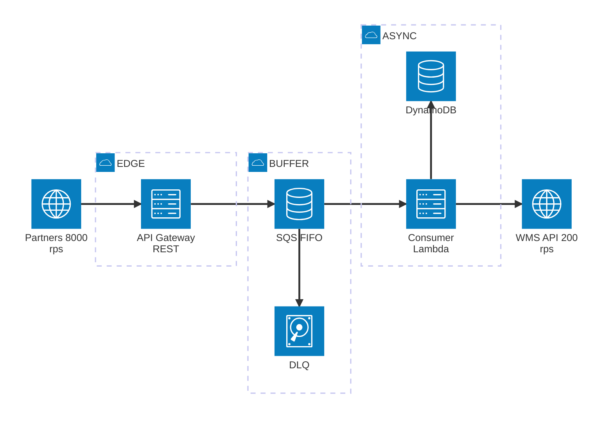
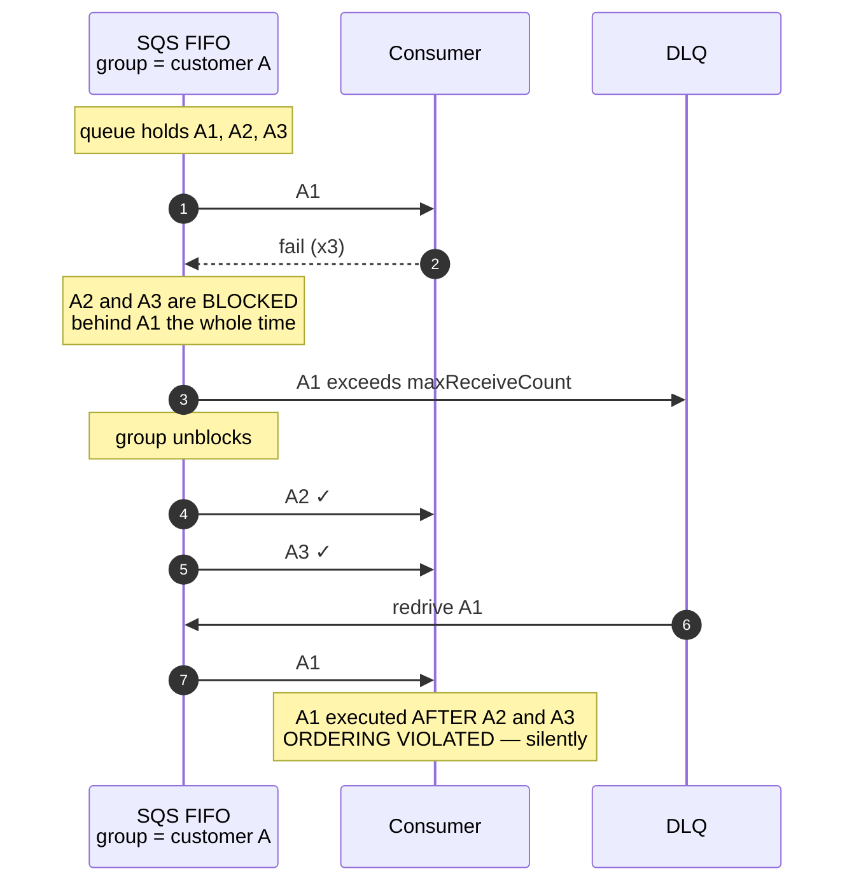
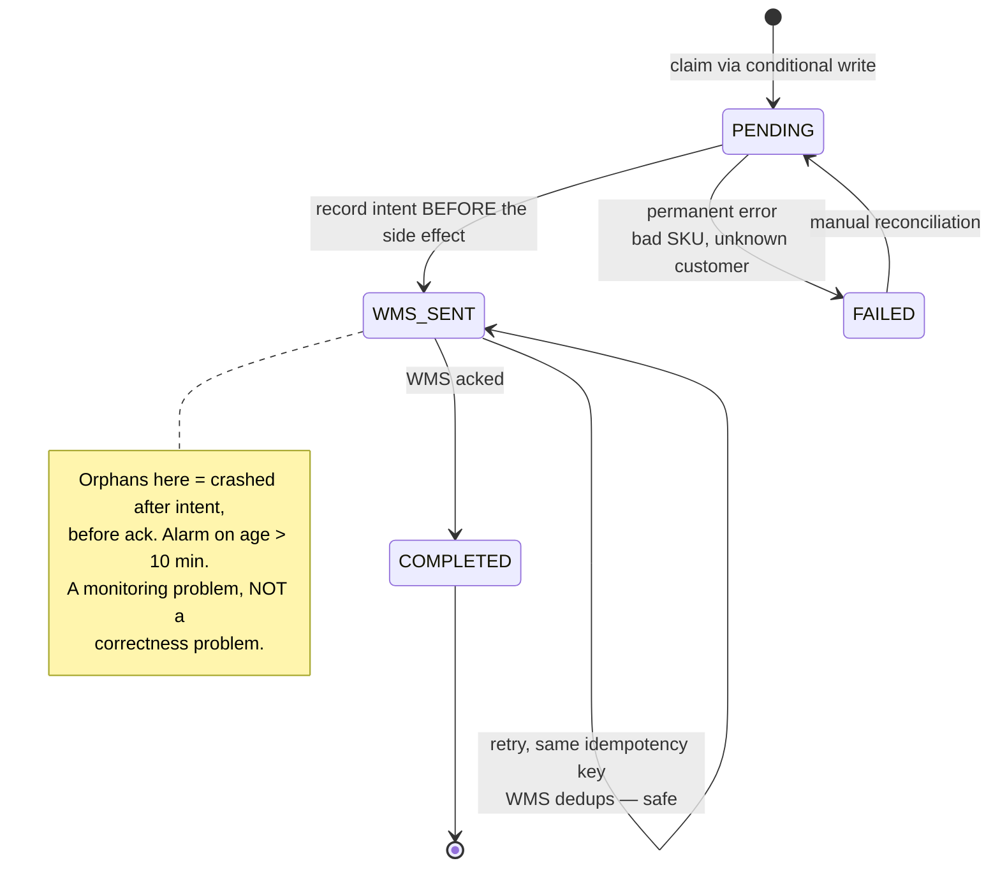
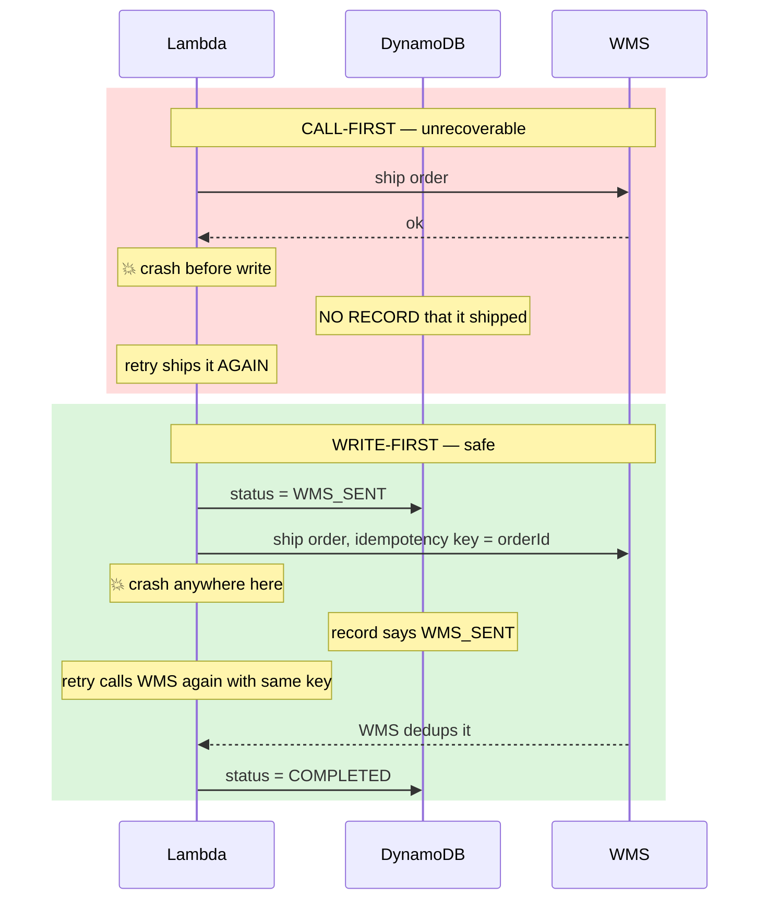
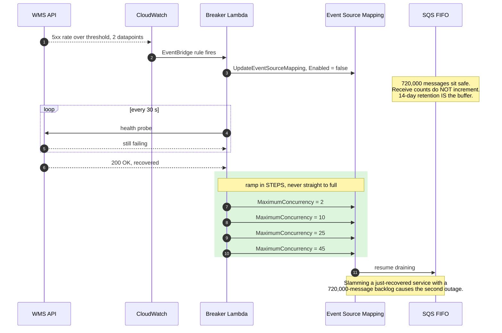

# Order Ingestion Pipeline — API Gateway → SQS → Lambda

A serverless LLD/system-design exercise: accept traffic 40× faster than you can process it,
never lose an order, never process one twice, and never break per-customer ordering.

> **Editable diagram:** [`order-ingestion-sqs-lambda-apigw.excalidraw`](./order-ingestion-sqs-lambda-apigw.excalidraw)
> — drag it onto [excalidraw.com](https://excalidraw.com) to open.

---

## The Problem

Build the order ingestion pipeline for a retail platform.

**Functional requirements**

- Partners `POST` orders to a public HTTPS endpoint.
- Each order must be validated, persisted, and trigger downstream fulfilment.
- The partner needs a **synchronous response** confirming acceptance.
- Orders for the **same customer** must be processed **in submission order**.
  Orders for different customers have no ordering constraint.

**Non-functional constraints**

| Constraint | Value |
|---|---|
| Peak ingress | **8,000 req/sec for ~90 seconds** (flash sale) |
| Baseline ingress | ~50 req/sec |
| Downstream WMS API | **200 req/sec hard ceiling**, occasional multi-minute 5xx |
| Duplicates | Expected — partners retry aggressively on timeout |
| Required stack | API Gateway → SQS → Lambda |

**The number that drives every decision:**

```
8,000 rps × 90 s   =  720,000 orders
WMS ceiling        =      200 orders/sec
─────────────────────────────────────────
Drain time         =    3,600 s  =  1 HOUR of backlog
```

You accept 40× faster than you can process. Everything below follows from that.

---

## Architecture



**The three tiers, and what each one is for:**

| Tier | Job | Must never |
|---|---|---|
| **EDGE** | terminate TLS, authenticate, validate structure, hand off in single-digit ms | block, or depend on anything downstream |
| **BUFFER** | absorb a 40× spike and hold it for up to 14 days | lose a message, or reorder within a customer |
| **ASYNC** | drain at exactly the rate the downstream tolerates | scale beyond the WMS ceiling |

**The wires** — architecture diagrams can't carry config, so here it is:

| # | Hop | Mechanism | Config that matters |
|---|---|---|---|
| 1 | Partner → API Gateway | HTTPS `POST /orders` | `Idempotency-Key` header **mandatory**. Responds **`202`**, never `200`. |
| 2 | API Gateway → SQS | **direct AWS service integration** — no Lambda | `MessageGroupId = customerId`<br/>`MessageDeduplicationId = Idempotency-Key` |
| 3 | SQS → Consumer | Event Source Mapping | `batchSize 10`, `MaximumConcurrency 45`, `ReportBatchItemFailures` |
| 4 | SQS → DLQ | redrive policy | `maxReceiveCount 5`. **One-way. There is no arrow back.** |
| 5 | Consumer → DynamoDB | conditional write | claim → `WMS_SENT` → `COMPLETED` |
| 6 | Consumer → WMS | HTTPS | ≤ 200 rps, `orderId` passed as the WMS idempotency key |
| 7 | Partner → Status API → DynamoDB | out-of-band read | `GET /orders/:orderId` — how the partner learns the real outcome |
| 8 | WMS → CloudWatch → Breaker → ESM | circuit breaker | see [Backpressure](#backpressure--the-circuit-breaker) |

### Why there is no Validator Lambda between API Gateway and SQS

This is the single biggest simplification, and it deletes three problems at once.

| | With validator Lambda | Direct SQS integration |
|---|---|---|
| Cold starts on a 90 s spike | ~640 concurrent from cold | none |
| Account concurrency pressure | competes with the consumer | none |
| Latency | Lambda init + exec | single-digit ms |
| Cost | ~3× | baseline |
| Failure modes between "sent" and "durable" | 2 | 1 |

Structural validation moves to an **API Gateway request validator** with a JSON Schema
model — bad payloads get a `400` without invoking any compute.

Integration request mapping template:

```
Action=SendMessage
&MessageGroupId=$util.urlEncode($input.path('$.customerId'))
&MessageDeduplicationId=$util.urlEncode($input.params('Idempotency-Key'))
&MessageBody=$util.urlEncode($input.body)
```

**The honest trade-off:** business validation (does this partner exist, is this SKU real)
can no longer happen synchronously. Structurally-valid-but-business-invalid orders are
accepted and rejected asynchronously via the status API / webhook.

Keep the Lambda **only if** the business genuinely requires synchronous business
validation — and if so, buy provisioned concurrency, because Lambda's ramp will not
reach ~640 concurrent instantly from cold.

`REST` API, not `HTTP` API: HTTP APIs are cheaper but offer neither direct SQS service
integration nor request validators. You need both.

---

## The Three Defects a Naive Design Ships With

### 1. FIFO throughput — fatal

Standard FIFO queues are quota'd at **300 transactions/sec per API action**, or
**3,000 msg/s if you batch 10 messages per `SendMessage`**.

One HTTP request → one message → **300 msg/s**. You need 8,000. You are **26× over**,
and the failure is not graceful: `ThrottlingException` → `500` to the partner →
partner retries → **load increases**.

**Fix — enable high-throughput FIFO.** Both attributes are required; setting one does nothing:

```
DeduplicationScope   = messageGroup
FifoThroughputLimit  = perMessageGroupId
```

Two consequences you must state out loud:

- **Dedup scope narrows** from queue-wide to per-message-group. Here that is fine and
  arguably better — the dedup key is an order for a customer, and
  `MessageGroupId = customerId`. If your dedup key were global, you have just broken it.
- **Throughput scales with the number of distinct message groups.** 8,000 rps across
  thousands of customers is fine. 8,000 rps from one whale customer is a single message
  group, which is serialised *by definition*. If you have whale partners you need a
  composite group key (`customerId` + shard) and you must admit you have weakened
  ordering to per-shard.

> Verify the current high-throughput FIFO quota for **your region** before committing —
> it varies by an order of magnitude between regions.

### 2. DLQ → FIFO redrive — a silent correctness bug

Almost everyone draws an arrow from the DLQ back into the main queue. Trace it:



**Fix: the DLQ is a parking lot, not a retry loop.** No automatic redrive.
Every message in it is a lost order — page on depth > 0. Replay only via a
reconciliation flow that inspects current state, never a blind replay.

**And note:** the head-of-line blocking in step 3 is **correct behaviour**. If customer
A's order 1 is unprocessable you *must not* process order 2 — that is the ordering
requirement being enforced. Detect it fast; do not engineer around it.

### 3. No backpressure on a 200 rps downstream

Nothing in the naive design tells the consumer that the WMS is limited. The event source
mapping scales out and hammers a dying API → 5xx → `maxReceiveCount` exhausted →
**valid orders land in the DLQ because the downstream was busy.** You lose orders to
someone else's outage.

**Fix:** cap the ESM *and* add a circuit breaker. See below.

---

## Consumer Sizing — the math

Little's Law, assuming WMS p99 = 300 ms and sequential calls within a batch:

```
per invocation  :  10 orders × 300 ms       =  3.0 s
throughput      :  10 / 3.0                 =  3.33 orders/sec/instance
for 200/sec     :  200 / 3.33               =  60 concurrent instances
ESM setting     :  45      ← 25% headroom; never run a dependency at 100%
```

| Setting | Value | Too low breaks | Too high breaks |
|---|---|---|---|
| WMS call timeout | 3 s | kills healthy slow calls | ties up a slot, cascades into Lambda timeout |
| Lambda timeout | 40 s | batch never finishes → all 10 retried forever | slow failures hold concurrency |
| Visibility timeout | 300 s | redelivery **while still processing** → duplicate work + burns receive count | slow recovery from a stuck consumer |
| Batch size | 10 | more invocations, more overhead | bigger blast radius per failure |
| `maxReceiveCount` | 5 | valid orders DLQ'd during a normal WMS blip | poison pill blocks its group for 25 min |
| ESM `MaximumConcurrency` | **45** | wastes WMS budget | **overwhelms WMS → 5xx → DLQ** |
| `FunctionResponseTypes` | `ReportBatchItemFailures` | — | not optional — without it one bad message retries all 10 |

**The relationships matter more than the numbers.** Six independent values scores badly
in an interview; these inequalities score well:

```
visibilityTimeout  ≥  6 × lambdaTimeout
lambdaTimeout      ≥  batchSize × wmsTimeout + overhead
retryBudget        =  maxReceiveCount × visibilityTimeout  ≥  expected WMS outage
maxConcurrency     ≤  wmsRateLimit / (batchSize / batchDuration)
ddbTtl             >  partnerRetryWindow + retryBudget + drainTime
                   >  24 h + 25 min + 1 h        →  set 7 days
```

---

## Idempotency — three layers

Make the idempotency key **contractual**. The partner supplies `Idempotency-Key`;
missing it is a `400`. **Never mint it server-side** — if you generate a UUID, a partner
retry produces a new ID and your entire dedup story is decorative.

| Layer | Mechanism | Catches |
|---|---|---|
| 1 | SQS `MessageDeduplicationId` | retry storms within 5 min — the majority |
| 2 | DynamoDB conditional write | everything beyond the 5 min window |
| 3 | `orderId` passed to WMS as its idempotency key | your own retries after a crash |

### Table design

```
PK   orderId          = partner-supplied Idempotency-Key
     status           PENDING | WMS_SENT | COMPLETED | FAILED
     customerId
     payloadHash      SHA-256 of CANONICALISED json (sorted keys)
     wmsRequestId
     attempts
     lockExpiresAt    epoch seconds
     ttl              epoch seconds — 7 days
```

`payloadHash` must be over a *canonicalised* payload. Hashing raw bytes means a
re-serialised retry with reordered JSON keys hashes differently and slips through.
That is why the key is partner-supplied and the hash is only a **conflict detector**:
same key + different hash is a partner bug → `422` + alarm.

### State machine



**The claim (step 1):**

```
UpdateItem
ConditionExpression:
      attribute_not_exists(orderId)
   OR #status = :FAILED
   OR (#status = :PENDING AND lockExpiresAt < :now)
UpdateExpression:
   SET #status = :PENDING,
       lockExpiresAt = :now + 60,
       attempts = attempts + 1
```

`ConditionalCheckFailedException` means **three different things**, and only one of them
is "safe duplicate":

| Current status | Meaning | Action |
|---|---|---|
| `COMPLETED` | true duplicate | delete message, return success |
| `WMS_SENT` | in-flight, or crashed after send | reconcile — call WMS again with the same key |
| `PENDING`, lock live | concurrent duplicate | return as batch item failure, retry later |

### Why write-first, not call-first



Write-first converts *"did the side effect happen?"* — unanswerable — into
*"call it again, idempotently"* — always safe. That is the whole trick.

**If the WMS does not support idempotency keys**, you must either query it by `orderId`
before retrying, or explicitly choose at-least-once with downstream duplicate detection.
There is no clever design that removes this choice; say which one you are taking.

### Cost — the point everyone misses

At 8,000 rps you might expect 8,000 WCU. **You need ~400.** DynamoDB writes happen at
*consumer* rate, which the WMS caps at 200/sec. Only API Gateway and SQS ever experience
the flash sale. That is the queue doing exactly its job.

On `ProvisionedThroughputExceededException`: **never delete the message.** Return it as a
batch item failure. Dropping on a throttle is silent data loss.

---

## Backpressure — the circuit breaker

> **The correct response to a dead downstream is to stop consuming, not to retry harder.**

If the WMS 5xx's for 20 minutes and you keep retrying, you burn the retry budget across
720,000 messages and DLQ valid orders because of someone else's outage.



---

## Error Classification — the actual poison-pill fix

```java
List<BatchItemFailure> failures = new ArrayList<>();

try {
    process(order);
} catch (PermanentException e) {        // bad SKU, unknown customer, schema violation
    ddb.markFailed(orderId, e);
    events.publishRejection(orderId, e);
    // return SUCCESS -> message deleted, group UNBLOCKS NOW
} catch (TransientException e) {        // WMS 5xx, DDB throttle, timeout
    failures.add(new BatchItemFailure(messageId));   // let SQS retry
}
```

Blindly throwing on every error turns one bad SKU into **25 minutes** of head-of-line
blocking for that customer (5 receives × 300 s visibility timeout). Permanent failures
must unblock the group on the *first* receive, not the fifth.

### FIFO partial batch failures

`ReportBatchItemFailures` is mandatory, but FIFO changes the semantics: a reported failure
also fails the **remaining messages in the same message group**, to preserve ordering.
Messages from *other* groups in the batch that succeeded are still deleted.

Implement it explicitly rather than depending on ESM internals:

```java
Map<String, List<SQSMessage>> byGroup = groupByMessageGroupId(event);

for (List<SQSMessage> group : byGroup.values()) {
    for (SQSMessage m : group) {
        if (!tryProcess(m)) {
            failures.addAll(remainingFrom(group, m));  // this one AND everything after
            break;                                     // stop this group, continue others
        }
    }
}
return new SQSBatchResponse(failures);
```

---

## The Two Claims That Sound Right

**"FIFO gives exactly-once processing."**
No — exactly-once **delivery**, within a 5-minute window. The queue cannot know whether
your side effects ran. Receive a message, call the WMS, crash before deleting → SQS
redelivers → you call the WMS twice. Exactly-once *processing* comes from the DynamoDB
conditional write plus an idempotent WMS call, not from the queue.

**"The DLQ solves the poison pill."**
It *bounds* it, at a cost you have to compute. With `maxReceiveCount: 5` and a 300 s
visibility timeout, a poison pill freezes its message group for **25 minutes** before
reaching the DLQ. It is the last line of defence, not the fix. Classify the failure instead.

---

## The Partner Contract

- **`202 Accepted`, never `200 OK`.** The backlog is one hour; `200` implies a fulfilment
  guarantee you cannot honour.
- `Idempotency-Key` header is **mandatory** → `400` if absent.
- Same key + different `payloadHash` → `422` + alarm. That is a partner bug, not a duplicate.
- `GET /orders/:orderId` for terminal status, backed by the same DynamoDB table.
- EventBridge / webhook on completion and rejection.
- Payloads > 10 MB → `413`. Payloads > 256 KB → presigned S3 upload, send the key
  (Extended Client Library pattern).

---

## Observability

| Metric | Alarm | Why it matters |
|---|---|---|
| `ApproximateAgeOfOldestMessage` | > 15 min | **The single most important SQS metric.** The only one that catches both a stalled message group and a stalled consumer. |
| `ApproximateNumberOfMessagesVisible` | trending | backlog depth / drain rate |
| DLQ depth | > 0 | page — every message here is a lost order |
| Lambda `Errors`, `Throttles` | > 0 | concurrency starvation |
| WMS 5xx rate | threshold | drives the circuit breaker |
| DynamoDB `ThrottledRequests` | > 0 | idempotency layer degrading |
| Items in `WMS_SENT` older than 10 min | > 0 | orphaned intents needing reconciliation |

---

## The Honest Conclusion

If the business needs sub-minute fulfilment at 8,000 rps, **the architecture is not the
constraint — the WMS is.** No amount of AWS design removes a 200 rps vendor ceiling.
That is a conversation about a bulk endpoint or a higher rate limit.

Naming this out loud scores higher in an interview than any configuration you could produce.

---

## Follow-up Questions

- One customer sends 500 rps on their own. Your `messageGroupId` is `customerId`.
  What breaks, and what does the fix cost you?
- The WMS adds a bulk endpoint accepting 100 orders per call. What changes — and does
  your ordering guarantee survive it?
- Partners now need a "cancel order" operation that must not overtake the create.
  Where does it enter the pipeline?
- You must support a second downstream with a 5,000 rps ceiling and no ordering
  requirement. Same queue or a new one? Justify.
- Regulatory: prove that a specific order was processed exactly once, 90 days later.
  What do you have to have written down?

---

> **Verify before you rely on it:** the AWS quota figures above — FIFO TPS limits,
> API Gateway rps/burst defaults, ESM concurrency ranges — are published defaults as of
> writing. Check the current SQS, API Gateway, and Lambda quota pages for your region
> before using these numbers in a real design review.
