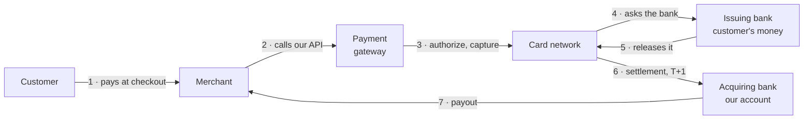
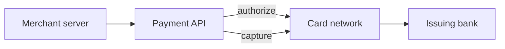
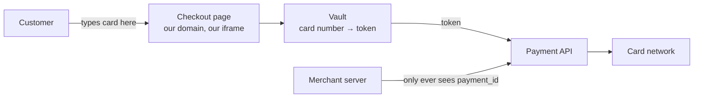
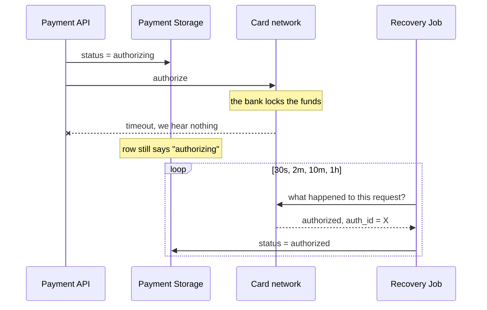
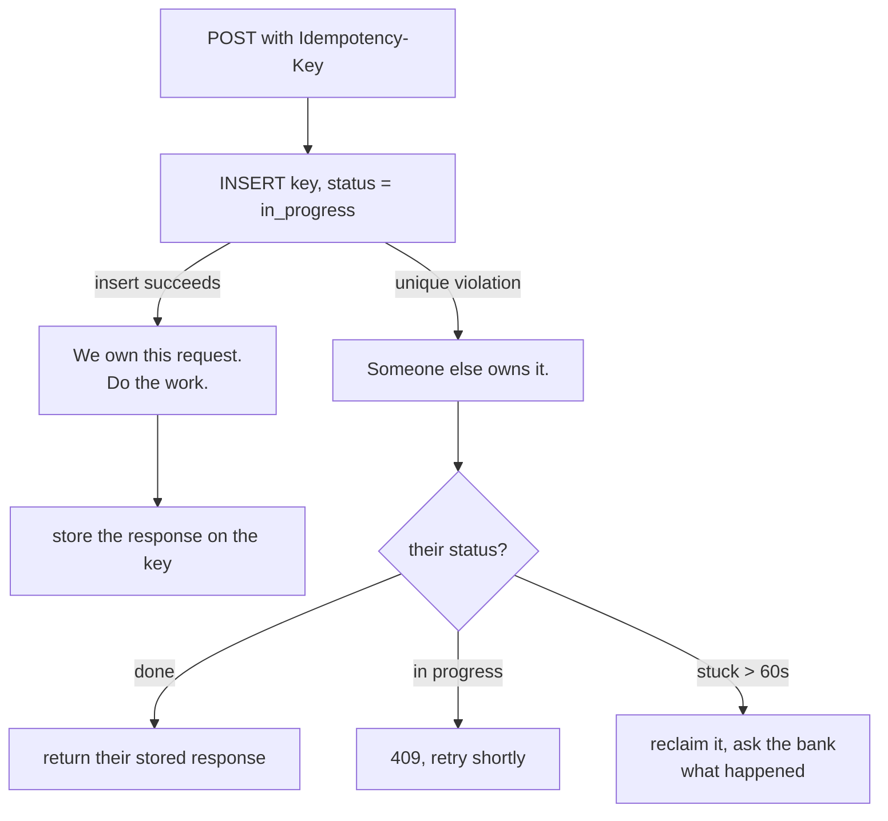
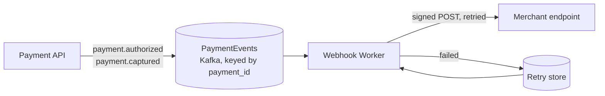
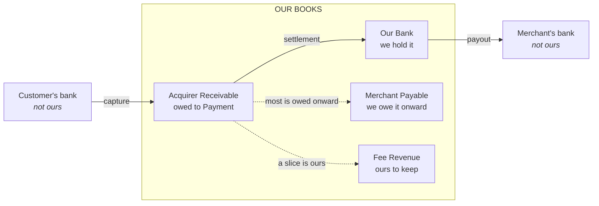
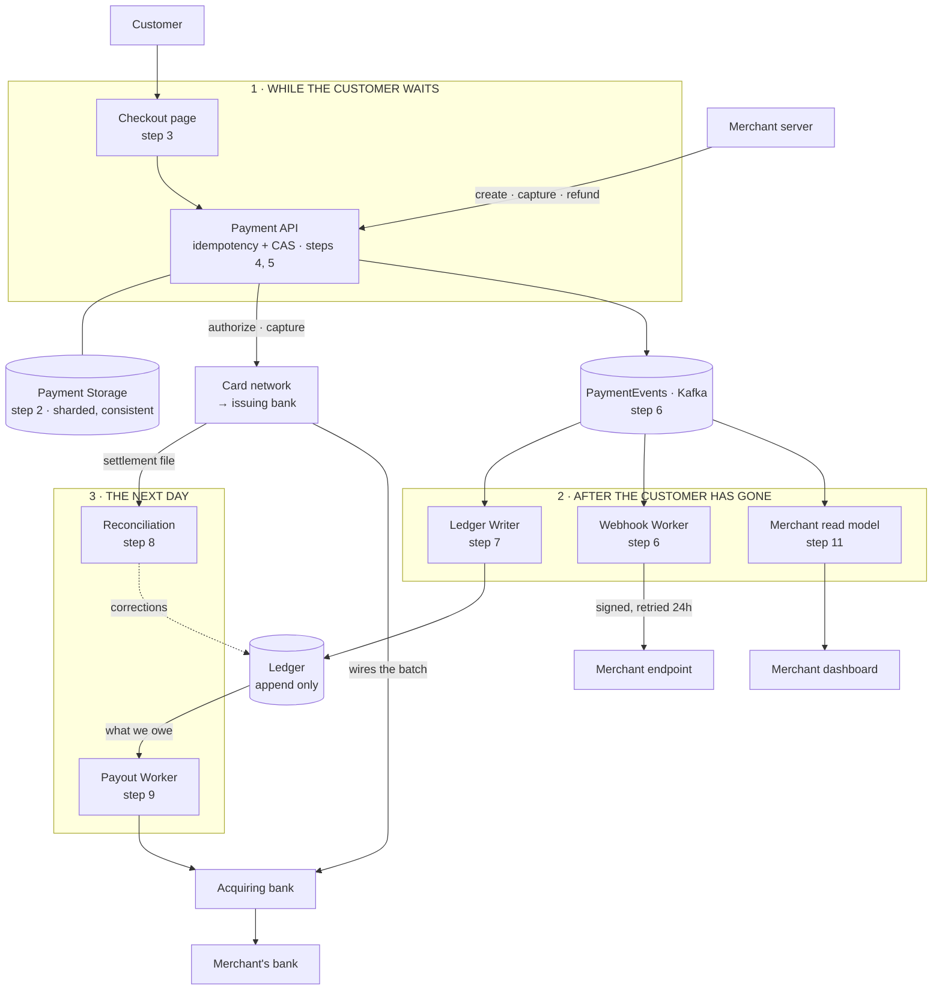

# Card Payment Gateway — System Design

A merchant wants to take card payments. They don't want to talk to Visa or to banks. They integrate Payment.

This document builds the system in one straight line. We start with the simplest thing that takes a payment, then break it, and each thing we add exists to fix the break. Nothing appears before there is a reason for it.

Card payments only. No fraud engine, no UPI or wallets, no KYC.

---

## First, the words

| Term               | Meaning                                           |
| ------------------ | ------------------------------------------------- |
| **Customer**       | The person paying. Holds the card.                |
| **Merchant**       | Our client. Sells something, wants the money.     |
| **Gateway**        | Payment.                                          |
| **Issuing bank**   | The customer's bank. Holds their money.           |
| **Card network**   | Visa, Mastercard. Carries messages between banks. |
| **Acquiring bank** | Our bank. Everyone's money lands here first.      |
| **Authorization**  | Lock funds on the card. Nothing has moved.        |
| **Capture**        | Say we want the money we locked.                  |
| **Settlement**     | The banks actually move it, a day or two later.   |
| **Payout**         | We send the merchant their share.                 |

And this is where money physically goes:



**The one fact everything else follows from:** we never move money. Banks do. We keep a record of what banks did. Every hard problem below comes from banks being slow, asynchronous, and sometimes completely silent.

---

## Step 1 — Take the payment

The simplest thing that works.



The merchant calls Payment with an amount. We do two things with the card network:

- **Authorize** — the issuing bank locks the money on the card. Nothing has moved yet, and the lock expires in about a week.
- **Capture** — we say we want it. Now the money is genuinely coming.

**Why two steps and not one?** Because merchants ship later. A shop authorizes when you order and captures when the box leaves the warehouse. If you merge them, you cannot support that, and you cannot retrofit it later.

**Why the Payment API exists at all:** so the merchant never has to speak Visa's protocol, hold bank relationships, or care that we use two acquirers.

Right now this system is useless, because it forgets everything the moment it answers.

---

## Step 2 — Remember what happened

**What breaks:** the merchant calls back an hour later asking "did payment X work?" and we have nothing. We also cannot capture later, because capture needs the `auth_id` the bank gave Payment.

**What we add: Payment Storage.**

```
payment   id, merchant_id, merchant_order_id, amount, currency,
          status, auth_id, captured_amount, refunded_amount, created_at
```

Status moves in one direction: `new → authorized → captured`, with `failed`, `voided` and `expired` as endings.

This one table is the spine of the whole system. Everything we add from here either writes to it, reads from it, or checks it against someone else.

---

## Step 3 — Keep the card number out of everyone's hands

**What breaks:** in step 1 the merchant collected the card and sent it to Payment. That makes _them_ subject to PCI-DSS, which they will refuse, and it puts card numbers in their logs.

**What we add: a checkout page we serve, and a token.**



The customer types the card into a page served by Payment, inside the merchant's checkout. The card number goes into the vault and comes back as a token. The merchant's server only ever holds a `payment_id`.

**Why bother:** the card number now touches exactly two components. A PCI audit covers those two instead of the entire company.

---

## Step 4 — Survive the bank not answering

**What breaks:** we call the bank, and the call times out. Did it authorize or not? We genuinely do not know. If we record `failed`, and the bank actually locked the money, the customer has been charged and the merchant thinks the sale never happened.

Every bank call has **three** outcomes: yes, no, and _I don't know_. At scale, the third one happens thousands of times a day.

**What we add: two more statuses, and a Recovery Job.**

```
new → authorizing → authorized → capturing → captured
```

`authorizing` and `capturing` are written to the database **before** the bank is called. They mean "we are about to do something, or we already did and never heard back".



**Why this works:** the row written before the call is the evidence that we tried. Without it, a crash leaves a charged customer and no trace at all. With it, recovery is just "ask the bank again".

**Two rules that come out of this, and they are the ones interviewers push on:**

- A timeout is never `failed`. The customer sees "processing".
- If one acquirer gives Payment a _definite decline_, we may retry on another. If it gives Payment an _unknown_, we may never retry elsewhere — that is how somebody gets charged twice by two different banks.

---

## Step 5 — Never charge twice

**What breaks:** the merchant's HTTP call times out, so their code retries. Now two identical requests are in flight. Both read the row as `new`, both call the bank, and the customer is charged twice.

**What we add: an idempotency key, and compare-and-swap on the status.**

**The key.** Every mutating call carries an `Idempotency-Key` header — mandatory, `400` without it. We never generate it ourselves, because a UUID we generate changes on every retry and protects nothing.

We insert the key **before** doing any work, so the database picks the winner:



Checking with a `SELECT` first does not work — both requests find nothing and both proceed.

**The compare-and-swap.** Inside the payment, every status change is conditional:

```sql
UPDATE payments SET status = 'authorizing'
 WHERE id = :id AND status = 'new';
```

Only one caller can win that update, so only one call ever reaches the bank. Zero rows updated is not an error — it means someone else got there first.

**Two more backstops:**

- We send our own attempt id to the card network as _their_ idempotency key, so even our own retry after a crash is safe. Capture is idempotent against `auth_id` by design.
- `UNIQUE (merchant_id, merchant_order_id)` on the payment row. Idempotency keys expire after a day; this is what stops a duplicate a week later when the merchant's retry job wakes up with a fresh key.

---

## Step 6 — Tell the merchant, even when they are down

**What breaks:** the payment succeeds while the merchant's server is restarting. They never learn about it, and they never ship the goods.

We cannot call the merchant inline either — their slow endpoint would make our customer wait, and their outage would take down our checkout.

**What we add: an event topic, and a Webhook Worker.**



- Retries with backoff — 10 s, 1 m, 5 m, 30 m, 2 h, 6 h — for 24 hours, then park it and alarm.
- Every webhook is signed with the merchant's secret so they can tell it is really Payment.
- Every event has an `event_id` and the merchant deduplicates on it, because we deliver at least once.
- **Webhooks are a hint. `GET /payments/{id}` is the truth.** A merchant who missed one must always be able to ask.

The topic is keyed by `payment_id`, so one payment's events stay in order. Across different payments, order does not matter.

**Why a topic and not a direct call:** everything else we add from here — ledger, dashboards, reports — is another consumer of this same topic. The payment path keeps writing one database and one topic, and never learns about any of them.

---

## Step 7 — Know where the money actually is

**What breaks:** the payments table says `captured`. It does not say whether the money has arrived, how much of it is ours, or how much we owe this merchant. At the end of the month we cannot answer "what do we owe everyone", and we cannot prove any number to an auditor.

**What we add: a Ledger.**

The rule that makes it work: **never store a balance you update.** `UPDATE balances SET amount = amount - 100` has no history and one bad write corrupts it forever. We store immutable entries and add them up.

Every event writes a group of entries that sums to zero — money always comes from somewhere and goes somewhere.



For a ₹1,000 payment at a 2% fee:

**Capture** — we are owed it, and most of it is owed onward:

| Account             | Dr   | Cr  |
| ------------------- | ---- | --- |
| Acquirer Receivable | 1000 |     |
| Merchant Payable    |      | 980 |
| Fee Revenue         |      | 20  |

**Settlement** — the money lands in our bank account:

| Account             | Dr   | Cr   |
| ------------------- | ---- | ---- |
| Our Bank            | 1000 |      |
| Acquirer Receivable |      | 1000 |

**Payout** — we pay the merchant:

| Account          | Dr  | Cr  |
| ---------------- | --- | --- |
| Merchant Payable | 980 |     |
| Our Bank         |     | 980 |

**Authorization writes nothing**, because nothing has moved. If you write entries at authorization, your books claim money on payments that may never be captured.

**Two things that keep it correct:**

- The ledger is a consumer of the same topic from step 6, so it is off the payment path. If it falls behind, payments still work.
- Kafka redelivers, so the group id is derived from the event — `hash(event_type, payment_id, event_id)` — with a unique index on it. A replayed event hits the constraint and is ignored. Same trick as step 5, one system further down.

---

## Step 8 — Check ourselves against the bank

**What breaks:** step 4 left some payments in `authorizing` that even the recovery job could not resolve, because the acquirer was down too. And our idea of the day's total will not match the bank's.

**What we add: daily reconciliation.**

The acquiring bank sends a settlement file: one row per transaction _they_ think happened. We match every row against our payments.

| Mismatch                   | What it means                          | What we do                                                        |
| -------------------------- | -------------------------------------- | ----------------------------------------------------------------- |
| In their file, not in ours | We lost the outcome                    | Create the payment, write the entries, credit the merchant, alarm |
| In ours, not in theirs     | We think it worked, they don't         | Hold it. Do not pay out.                                          |
| Amounts differ             | FX, partial capture, or a real bug     | Hold it. Never auto-correct an amount.                            |
| Same authorization twice   | We retried something we shouldn't have | Refund one, fix the retry logic                                   |

**Why this matters more than it sounds:** row one is how a customer who was charged during our outage actually gets their goods. Reconciliation is not cleanup — it is the thing that makes the system correct, because every network call we make can fail in a way we cannot interpret.

---

## Step 9 — Pay the merchant

**What breaks:** nothing has actually reached the merchant's bank account yet.

**What we add: a Payout Worker.**

Money does not arrive per payment. The acquiring bank sends one wire covering the whole day. The payout is Payment splitting that wire up:

```
per merchant, once the day is reconciled:

    captured − refunds − our fee − chargebacks − rolling reserve
```

**Read from the ledger, never from the payments table.** The payments table is what we _believe_ happened; the ledger is what has been checked against the bank. A payout computed from the payments table pays out money we have not received.

---

## Step 10 — Refunds and chargebacks

**What breaks:** the customer returns the goods.

A refund is a payment in reverse, with one difference that makes it dangerous: **nobody is waiting for it**, so a bug leaks money quietly for weeks.

The guard has to be one conditional write, not a check followed by an update:

```sql
UPDATE payments
   SET refunded_amount = refunded_amount + :amt
 WHERE id = :id
   AND status IN ('captured','partially_refunded')
   AND refunded_amount + :amt <= captured_amount;
```

Zero rows updated means over-refund, and we reject it. `SELECT`, add up in code, then `UPDATE`, and you lose real money the first time two refunds race.

**In the ledger, a refund is not the capture reversed:**

| Account          | Dr   | Cr   |
| ---------------- | ---- | ---- |
| Merchant Payable | 1000 |      |
| Our Bank         |      | 1000 |

The merchant gives back the full ₹1,000, but our ₹20 fee stays earned — most schemes do not return the processing fee. Anyone who implements refunds as "flip the signs" quietly loses revenue.

A **chargeback** is the customer's bank taking the money back, plus a dispute fee, both charged to the merchant. If we already paid that merchant out, `Merchant Payable` goes negative — which is exactly the number risk wants, and the reason we hold a rolling reserve.

---

## Step 11 — Make it survive real traffic

Only now do the numbers matter:

```
100M payments/day    →  ~1.2k rps average, ~10k rps at peak
~10 events each      →  ~1B ledger rows/day
payment rows         →  ~100 GB/day, never deleted
```

**What breaks:** one database.

**What we add: sharding, and one read model.**

| Store            | Shard by                    | Why                                                                 |
| ---------------- | --------------------------- | ------------------------------------------------------------------- |
| Payment Storage  | `payment_id`                | Every hot operation is a lookup by id. Spreads evenly, no hotspots. |
| Merchant Storage | `merchant_id`               | Always read by merchant. Small and cacheable.                       |
| Ledger           | account, partitioned by day | Written constantly, read in bulk at close of day. Old days go cold. |

**The problem this creates:** a merchant dashboard asks "show my payments today", but payments are sharded by `payment_id`, so that query hits every shard.

**The fix:** another consumer of the topic from step 6 builds a merchant-oriented read model, sharded by `merchant_id`. It lags by seconds, which a dashboard does not care about, and it keeps reporting load off the store that authorizations depend on. A merchant big enough to hotspot it gets a composite key of `merchant_id` + day.

---

## Step 12 — Decide what to give up

**What breaks:** a shard leader goes down mid-payment.

Not every store needs the same guarantee:

| Store            | Choice                            | Why                                                                                                                                                                      |
| ---------------- | --------------------------------- | ------------------------------------------------------------------------------------------------------------------------------------------------------------------------ |
| Payment Storage  | **Consistent**                    | The compare-and-swap in step 5 is only correct on linearizable reads and writes. A stale read here charges someone twice. If the leader is unreachable, we return `503`. |
| Merchant Storage | Eventually consistent             | A webhook URL a few seconds stale harms nobody.                                                                                                                          |
| Ledger           | Never lose a write, reads may lag | Entries are append-only and idempotent, so they replay safely.                                                                                                           |
| Read models      | Eventually consistent             | Dashboards tolerate seconds.                                                                                                                                             |

**The sentence to say out loud:** refusing a payment costs one sale; charging twice costs a customer, a chargeback, a fee, and trust. That is why the payment path chooses consistency and fails closed.

---

## The whole thing

Every box below arrived in one of the twelve steps.



Three bands, in time order: the customer's few seconds, then everything that happens once they have gone, then the next day when the bank tells Payment what really happened and the money moves.

---

## What to watch

| Signal                                  | Alarm when               | Why                                                                |
| --------------------------------------- | ------------------------ | ------------------------------------------------------------------ |
| Payments stuck in `authorizing`         | Older than 15 min        | Someone may be charged with no record. Most important metric here. |
| Authorization success rate per acquirer | Down 5% from baseline    | Earliest sign an acquirer is failing                               |
| Ledger entry groups not summing to zero | Ever                     | Should be impossible                                               |
| Unmatched settlement rows               | Any, after the daily run | Each one is real money in the wrong place                          |
| Idempotency keys stuck in progress      | Over 60 s                | Crashed mid-payment, needs reclaiming                              |
| Webhook retry backlog                   | Growing                  | Merchants are blind                                                |

---

## Follow-up questions

- A capture arrives twice with the same key while the first is still waiting on the bank. What does each caller see?
- A merchant captures ₹600 of a ₹1,000 authorization, then refunds ₹300. Write every ledger entry, and say what happens to the remaining ₹400 hold.
- Capture and refund events reach the ledger out of order. What stops the balance being wrong?
- A chargeback arrives 90 days after you already paid the merchant. Where does the money come from?
- The settlement file lists a capture you have no record of. Rebuild it — what must you have written down at the time?
