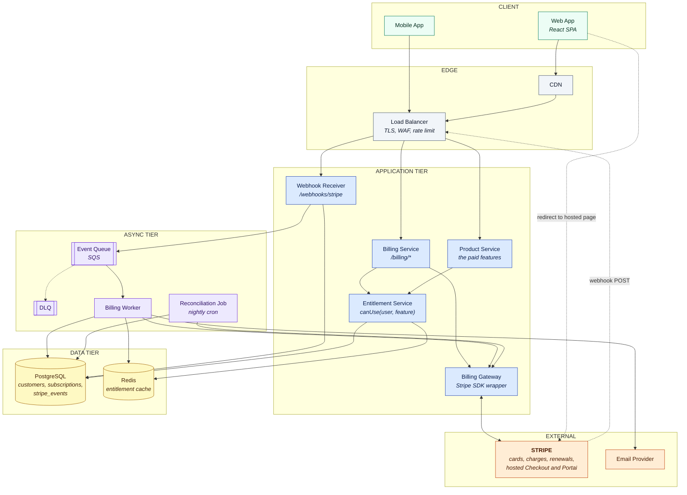
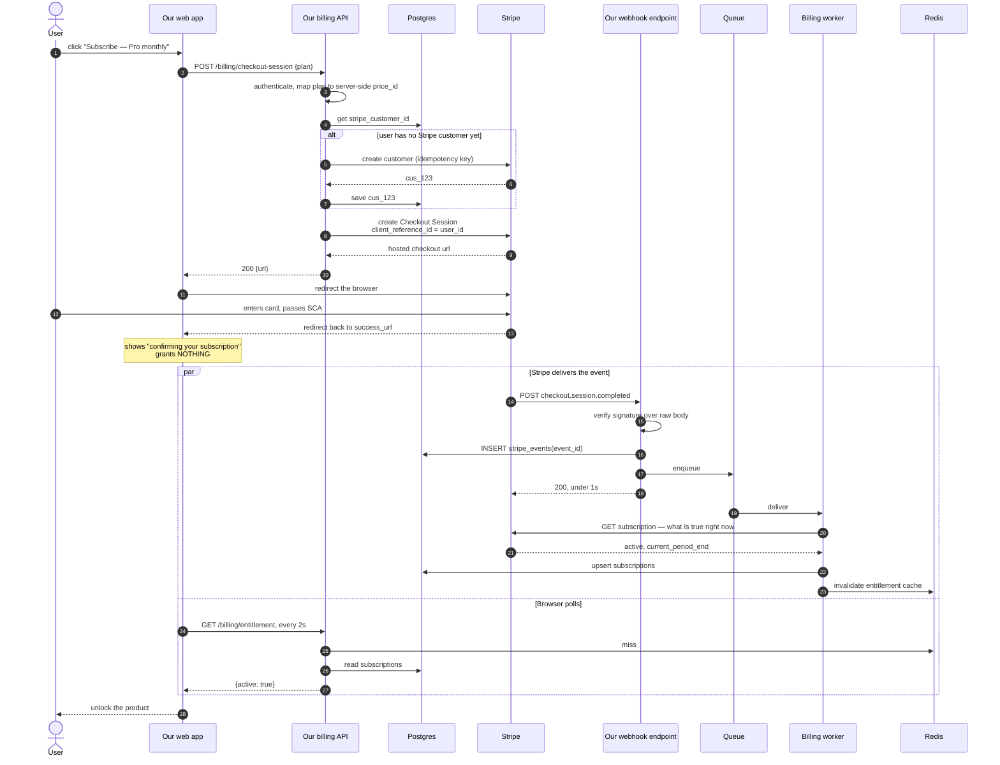
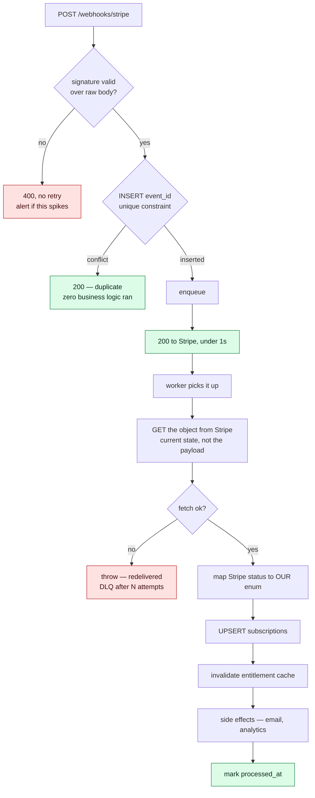
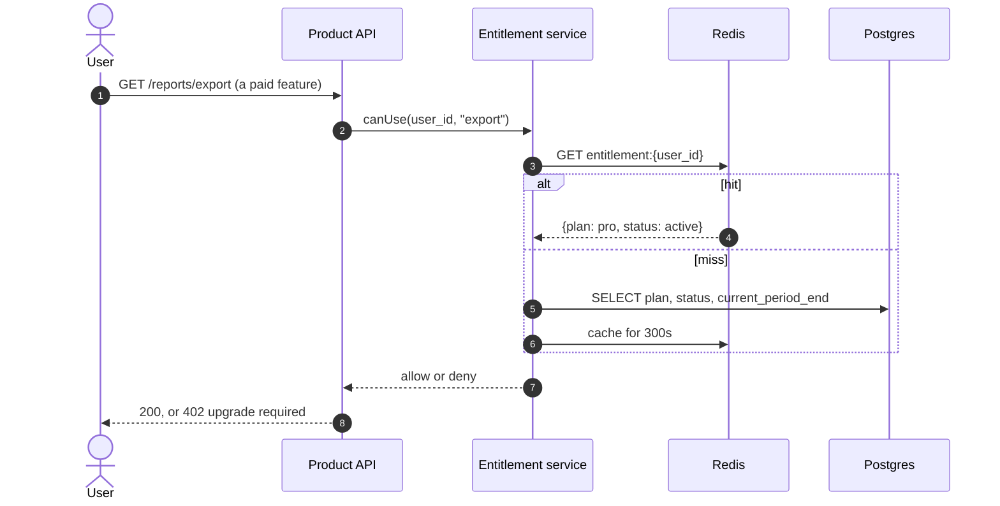
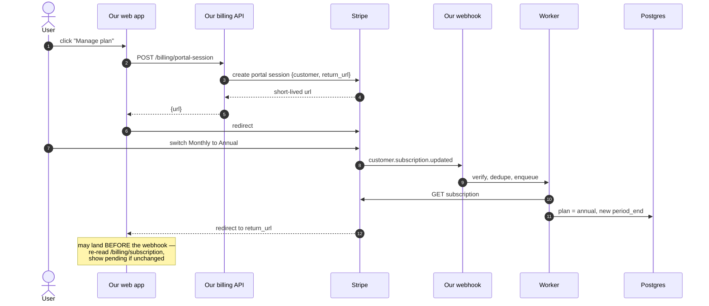
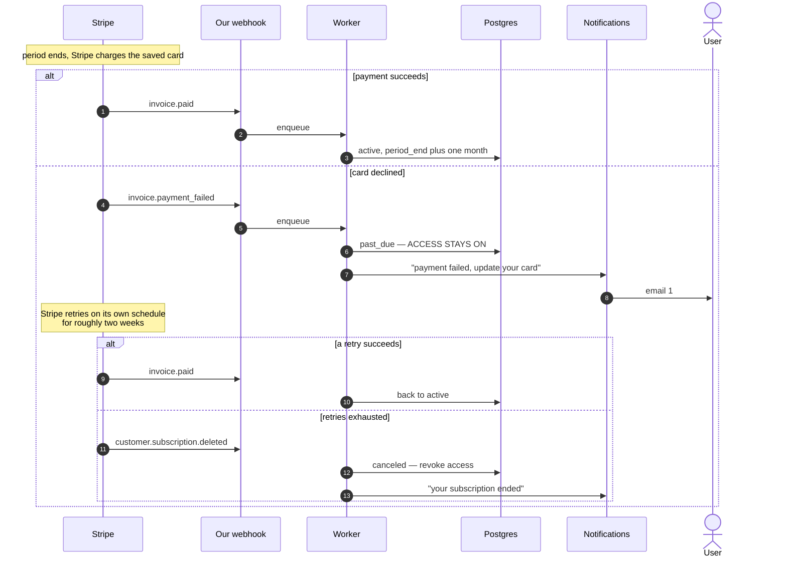
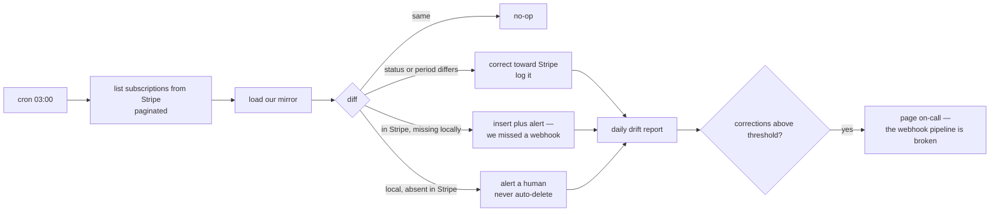
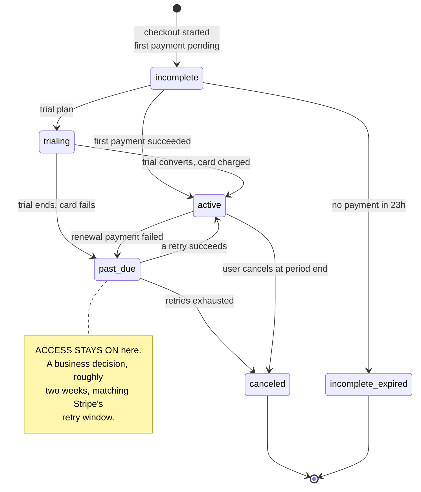

# Subscription Billing With Stripe

Our website sells features on a subscription. A user clicks **Subscribe**, and from then on the product must unlock exactly what they paid for — never more, never less.

> **Scope:** this is the design of **our system**. Stripe is a black box we rent. We are not designing Stripe, we are designing everything on our side of the wire: our endpoints, our tables, our services, and what happens when Stripe misbehaves.

> **Resume bullet:** _"Built Stripe membership payment integration end-to-end, including webhook handling, subscription lifecycle for 15k+ users."_

---

## The Problem

**Functional requirements**

- Subscribe to monthly or annual plans, with a free trial
- Upgrade, downgrade, and cancel, with correct proration
- Recover from failed payments (dunning) before losing the customer
- Access to paid features reflects billing state, promptly and correctly

**Non-functional constraints**

| Constraint     | Value                                                               |
| -------------- | ------------------------------------------------------------------- |
| Subscribers    | ~15k active                                                         |
| Billing events | ~500–2,000 webhooks/day, spiky at renewal dates                     |
| Correctness    | **Absolute** — money and access must agree                          |
| PCI scope      | Keep to SAQ-A: card data never touches our servers                  |
| Third party    | Stripe is authoritative for billing, and can be slow or unavailable |

**The thing that makes this hard is not scale.** 15k subscribers is a rounding error in throughput terms. Every difficulty here is correctness under partial failure: duplicate webhooks, out-of-order webhooks, lost redirects, timed-out API calls. Say that early — it reframes the whole conversation away from "add a queue and scale it."

---

## The central design decision

> **Stripe is the source of truth for billing. Our database is the source of truth for entitlement — and it is a mirror, kept in sync by webhooks with a reconciliation job behind it.**

The two alternatives are both wrong:

- **Call Stripe on every entitlement check** — a third-party API on your hot path. Their latency becomes your latency, their outage becomes your outage.
- **Never mirror, trust the client** — the browser tells you it paid. Trivially forged.

So: mirror subscription state locally, treat webhooks as the sync mechanism, and reconcile nightly because webhooks can be missed.

---

## Stripe is a black box. We touch it in exactly three places.

Everything Stripe does internally — how it stores cards, how it charges, how it decides when to retry — is deliberately none of our business. What matters for the design is the **surface**, and it's small:

| # | Touchpoint | Direction | Where it lives in our code |
| --- | --- | --- | --- |
| 1 | **Hosted pages** — Checkout (pay) and Customer Portal (manage plan) | We redirect the user's browser there | `POST /billing/checkout-session`, `POST /billing/portal-session` return a URL |
| 2 | **REST API** — `api.stripe.com` | We call out | A single `BillingGateway` class. Nothing else in the codebase imports the Stripe SDK |
| 3 | **Webhooks** | Stripe calls in | `POST /webhooks/stripe`, one public endpoint |

**What we get for that, and therefore do not build:**

- Card storage and PCI-compliant collection — the card never reaches our servers
- Charging the card, SCA/3DS challenges, retries when a bank declines
- Knowing when each subscription renews, and generating the invoice
- Proration maths when someone switches plan mid-cycle
- Invoice PDFs and the hosted receipt page

Two consequences worth stating out loud in an interview:

- **Keeping the Stripe SDK behind one gateway class is an anti-corruption layer.** Business logic never sees a `Stripe.Subscription` object or a Stripe status string.
- **Stripe is a dependency that can be slow or down.** Everything below is designed so that a Stripe outage degrades *new signups*, not *existing users' access*.

---

## Architecture



Solid arrows are server-to-server calls. Dotted arrows are the two hops that leave our control: the browser redirecting to a Stripe-hosted page, and Stripe calling back into us.

Read the diagram as two independent halves that meet in the database:

- **The buy path** (1→6) is synchronous and user-facing. It ends with the user staring at a "confirming…" spinner and **no access granted yet**.
- **The sync path** (7→12) is asynchronous and is the only thing that ever grants access.

---

## Our components

| Component | What it does | Why it exists separately | What happens when it fails |
| --- | --- | --- | --- |
| **Web app** | Pricing page, redirect to Stripe, poll for entitlement after returning | — | User closes the tab mid-flow. Must not matter — the webhook still lands |
| **Billing API** | `POST /billing/*`. Creates checkout and portal sessions, reads mirrored state | Keeps billing endpoints separate from product endpoints, with their own rate limits and alerting | Signup breaks. Existing users unaffected |
| **BillingGateway** | The only class that imports the Stripe SDK. Wraps calls with idempotency keys, timeouts, retries | Anti-corruption layer. Makes the whole thing mockable in tests, and swappable in principle | Stripe outage is contained here — one place to add a circuit breaker |
| **Product API** | The features we sell | — | — |
| **Entitlement service** | `canUse(userId, feature)` — the one answer to "may this user do this?" | Feature code must never read `subscription.status` directly. Status→feature mapping lives in one place, so a new plan is config | Falls back cache → DB. Never calls Stripe |
| **Webhook receiver** | Verify signature → insert `event_id` → enqueue → `200`. Nothing else | Deliberately dumb, so it's always fast | Must return under Stripe's timeout or Stripe retries work that already succeeded |
| **Queue + DLQ** | Decouples "Stripe is waiting for a 200" from "do the actual work" | The work involves an outbound API call and DB writes — too slow for the request | Poison event goes to DLQ, alarms, replayable by hand |
| **Billing worker** | Re-fetch the object from Stripe, upsert the mirror, invalidate cache, trigger email | **The only writer to `subscriptions`** | Idempotent — re-running writes the same current state |
| **Postgres** | `customers`, `subscriptions`, `stripe_events` | Source of truth for entitlement | Unique constraints are the dedupe mechanism, not application code |
| **Redis** | `entitlement:{user_id}`, TTL 5 min | Keeps feature checks off the DB | TTL bounds staleness even if an invalidation is lost |
| **Reconciliation job** | Nightly: list from Stripe, diff against our mirror, correct or alert | The safety net for our own sync failing | If it's noisy, the webhook pipeline is broken — that's the signal |
| **Notifications** | Dunning emails, trial-ending, receipts | — | — |

**The single most important rule in this table:** only the worker and the reconciliation job write to `subscriptions`. Not the API, not an admin script, not a support tool. One writer means the mirror can never contradict itself.

---

## API surface

### What our frontend calls

| Method | Path | Auth | Body | Returns | Backend work |
| --- | --- | --- | --- | --- | --- |
| `POST` | `/billing/checkout-session` | Session JWT | `{ "plan": "pro_monthly" }` | `{ "url": "..." }` | Map plan → **server-side** price ID, find-or-create Stripe customer, create Checkout Session with an idempotency key |
| `POST` | `/billing/portal-session` | Session JWT | — | `{ "url": "..." }` | One Stripe call. Stripe's hosted page handles upgrade, cancel, card update |
| `GET` | `/billing/subscription` | Session JWT | — | `{ plan, status, current_period_end, cancel_at_period_end }` | Pure read of our mirror. **Never calls Stripe** |
| `GET` | `/billing/entitlement` | Session JWT | — | `{ active, features[] }` | Read-through cache. This is what the success page polls |
| `POST` | `/billing/cancel` | Session JWT | `{ "at_period_end": true }` | `202` | Only if we don't use the Portal. Calls Stripe, then **waits for the webhook** to change local state |

### What Stripe calls

| Method | Path | Auth | Must do | Must not do |
| --- | --- | --- | --- | --- |
| `POST` | `/webhooks/stripe` | **None.** The `Stripe-Signature` HMAC over the **raw body** *is* the authentication | Verify → insert `event_id` → enqueue → `200` | Business logic, extra DB writes, anything slow |

> Mount this route **before** JSON body-parsing middleware, or with a raw-body parser. Parsed-then-restringified JSON doesn't reproduce the bytes Stripe signed, so verification fails in production while passing every local test that replays a saved fixture.

### What we call on Stripe (all inside `BillingGateway`)

| Purpose | Stripe endpoint | Idempotency key |
| --- | --- | --- |
| Create the customer, first time a user checks out | `POST /v1/customers` | `user:{id}:customer` |
| Start a purchase | `POST /v1/checkout/sessions` | `user:{id}:checkout:{price}:{attempt}` |
| Open the manage-plan page | `POST /v1/billing_portal/sessions` | not needed, read-only |
| **Re-fetch current state on every webhook** | `GET /v1/subscriptions/{id}` | — |
| Change plan without the Portal | `POST /v1/subscriptions/{id}` | `user:{id}:change:{price}:{attempt}` |
| Cancel | update `cancel_at_period_end` | `user:{id}:cancel:{sub}` |
| Nightly diff | `GET /v1/subscriptions?status=all&limit=100` | — |

Pass `client_reference_id = our user id` (and `metadata.user_id`) when creating the Checkout Session. That's how the webhook finds its way back to a user without trusting anything the browser told us.

### Events we subscribe to

| Event | Worker action |
| --- | --- |
| `checkout.session.completed` | **The grant moment.** Resolve user from `client_reference_id`, fetch subscription, upsert, unlock |
| `customer.subscription.updated` | Fetch and upsert — covers plan change, trial end, status change, cancel scheduled |
| `customer.subscription.deleted` | Mark canceled, revoke |
| `invoice.paid` | Renewal succeeded — fetch subscription for the new `current_period_end` |
| `invoice.payment_failed` | Mark `past_due`, **keep access**, start dunning email |
| `customer.subscription.trial_will_end` | Prompt for a card 3 days out |

Everything else gets a `200` and is ignored — but **log the unhandled type**. The alternative is discovering a year later that you needed one.

---

## Data model

```sql
-- bridge between our user and Stripe's customer
customers(
  user_id            uuid primary key,
  stripe_customer_id text unique not null,
  created_at         timestamptz
)

-- the mirror. Derived from Stripe, never authored by us
subscriptions(
  id                     uuid primary key,
  user_id                uuid not null references customers,
  stripe_subscription_id text unique not null,
  plan                   text not null,   -- OUR enum, not Stripe's price id
  status                 text not null,   -- OUR enum, mapped from Stripe's
  current_period_end     timestamptz not null,
  cancel_at_period_end   boolean not null default false,
  trial_end              timestamptz,
  updated_at             timestamptz
)
create index on subscriptions(user_id)
  where status in ('active','trialing','past_due');

-- dedupe plus audit. The primary key IS the idempotency mechanism
stripe_events(
  event_id     text primary key,   -- evt_...
  type         text not null,
  payload      jsonb not null,
  received_at  timestamptz not null,
  processed_at timestamptz,
  attempts     int not null default 0,
  status       text not null       -- received | processed | failed
)
```

Cache: `entitlement:{user_id}` → `{plan, status, period_end}`, TTL 5 minutes.

---

## Flow 1 — A user buys a subscription

The main flow, end to end.



**Step by step on our side:**

1. **`POST /billing/checkout-session`** — authenticate, then resolve `plan` → `price_id` from **our** config. The client never sends a price or an amount.
2. **Find-or-create the Stripe customer**, and persist `stripe_customer_id` before anything else. A create that succeeds at Stripe but isn't saved produces a duplicate customer on the next attempt.
3. **Create the Checkout Session** with `client_reference_id = user_id`. Our request finishes in ~200ms.
4. **Return the URL**; the browser redirects itself. We are now out of the loop entirely.
5. **The user pays on Stripe's page.** Card, 3DS, first charge — none of it touches us, which is the whole PCI argument.
6. **The redirect back is not proof of payment.** The success page renders a pending state and polls `GET /billing/entitlement`.
7. **The webhook grants access.** Verify → insert → enqueue → `200`, then the worker re-fetches and writes the mirror.
8. **The poll flips to `active`**, usually a second or two later. If the browser died at step 6, the user is still fully subscribed — they just see it on the next page load.

---

## Flow 2 — Handling the webhook



Three properties this shape buys:

- **The `200` is fast and unconditional** once the signature checks out. Slow handlers make Stripe retry work that already succeeded.
- **Duplicates die at the unique constraint**, before any logic runs — not a `SELECT` then `INSERT`, which races.
- **The worker is idempotent because it writes current state, not deltas.** Run it twice, or out of order, and it converges.

---

## Flow 3 — Checking access on a normal request

This is 99.9% of traffic, and it must never touch Stripe.



- **Feature code calls `canUse(...)`**, never `status == "active"`. Adding a plan becomes a config change.
- **`past_due` returns allow** during the grace window — a business rule, living in the one place business rules belong.

---

## Flow 4 — Upgrade, downgrade, cancel

Cheapest correct answer: **send them to Stripe's Customer Portal.** One API call, and we get proration UI, card updates and cancel flows for free. The result comes back to us as `customer.subscription.updated`, exactly like everything else.



Building it ourselves instead means `POST /v1/subscriptions/{id}` with an explicit proration choice:

| Change | Choice | Why |
| --- | --- | --- |
| Upgrade | prorate and invoice now | They get more immediately, so charge the difference immediately |
| Downgrade | schedule at period end | No mid-cycle refund; they already paid for this month |
| Cancel | `cancel_at_period_end: true` | Access until the paid period ends. Immediate cancel is a refund conversation |

**Never write the new plan into our DB right after the Stripe call returns.** Let the webhook do it. One writer to the mirror means no path where the API response and the webhook disagree.

---

## Flow 5 — Renewal fails (dunning)



Stripe schedules and performs every retry. Our entire job: mirror the status, keep access on during `past_due`, send the emails.

---

## Flow 6 — Nightly reconciliation



Small drift auto-corrects toward Stripe. **Anything structural alerts a human** — a local row with no Stripe counterpart is either a bug or someone granting themselves a subscription, and a cron job should not silently resolve that.

---

## The five failure modes that define the design

### 1. The redirect is not a payment confirmation

`success_url` fires in the user's browser. They can close the tab, lose signal, or never load it — and the payment still succeeded. Equally, someone can navigate to that URL directly having paid nothing.

> **Grant access on `checkout.session.completed`, never on the redirect.** The success page shows a "confirming your subscription" state and polls our own API for entitlement. It's a UI affordance, not an authorization event.

### 2. The webhook endpoint is public

It's the only ingress Stripe has, so it can't sit behind our auth. Anyone can `POST` to it.

> **Signature verification is the authentication.** The `Stripe-Signature` header is an HMAC over the raw body plus a timestamp, checked against the endpoint secret with a constant-time compare, and the timestamp tolerance blocks replay.

The detail that trips people: verification runs against the **raw request body**. Any middleware that parses JSON before the handler sees it will break the signature check — a genuinely common bug, and worth naming.

### 3. Webhooks arrive more than once

Stripe retries with backoff for up to about three days on non-2xx, and can deliver the same event more than once even after a success.

> **`event.id` is the idempotency key.** A unique constraint on the events table turns duplicate handling into an insert conflict — the second one is dropped before any business logic runs. Let the database enforce it rather than a `SELECT` that races.

This is also why the handler must **return 200 fast**. Stripe times out in the tens of seconds; do the work inline, exceed it, and Stripe retries an operation that actually succeeded. Verify, persist, enqueue, return — the real work happens on the queue.

### 4. Webhooks arrive out of order

**Stripe does not guarantee ordering.** `customer.subscription.updated` can land before `.created`. Naively applying each payload in arrival order writes stale state and leaves a customer on the wrong plan.

Two defenses, and the second is much better:

- Compare `event.created` and discard anything older than what you've applied — works, but needs per-object version tracking
- **Treat the webhook as a signal, not as data.** On receipt, re-fetch the object from the Stripe API and write _current_ state. Ordering stops mattering entirely, because you always converge on what's true now.

> "The event tells us something changed. It doesn't tell us what things are. So we ask."

Cost is one extra API call per event; at ~2k events/day that's free. State it as the deliberate trade it is.

### 5. Our own call to Stripe times out

We `POST` a subscription, the connection drops, and we don't know whether it was created. Retry blindly and we may have just billed someone twice.

> **`Idempotency-Key` on every outbound write.** Stripe returns the original result for a repeated key rather than performing the action again. Key it on something stable and request-specific — user ID plus intent plus attempt, not a fresh UUID per retry, which defeats the point.

---

## Subscription lifecycle



| Stripe status         | Access           | Notes                                                  |
| --------------------- | ---------------- | ------------------------------------------------------ |
| `incomplete`          | No               | Awaiting first payment / SCA challenge                 |
| `trialing`            | Yes              | Card may not be charged yet                            |
| `active`              | Yes              | Steady state                                           |
| `past_due`            | **Yes, briefly** | Payment failed, Stripe is retrying — business decision |
| `unpaid` / `canceled` | No               | Retries exhausted or user cancelled                    |

**Wrap these in our own enum.** Stripe's status strings scattered through the codebase is an anti-corruption-layer failure: it couples business logic to a vendor's vocabulary, and it makes mocking or swapping the provider painful.

**The `past_due` grace period is a business decision, not a technical one** — and saying so scores well. Revoking access the instant a card fails punishes customers whose bank declined a routine renewal. Most products keep access through Stripe's retry window (~2 weeks) while sending increasingly direct emails. That's dunning, and it's usually worth more in retained revenue than the cost of the grace period.

---

## Reconciliation — the safety net

Webhooks get missed. The endpoint is down past the retry window, a deploy breaks signature verification, someone misconfigures the endpoint in the dashboard.

> A nightly job lists subscriptions from Stripe, diffs them against our table, and reports mismatches. Small drift auto-corrects toward Stripe; anything structural alerts a human.

Two reasons to raise this unprompted: it's the honest acknowledgement that an event-driven sync is eventually consistent and can silently diverge, and it's the control an auditor or finance team will ask about. Interviewers notice when a candidate designs for the case where their own mechanism fails.

---

## Security and compliance

- **Stripe Checkout or Elements means card data never touches our servers.** That keeps PCI scope at SAQ-A, the simplest tier. Accepting a raw card number anywhere — even proxying it — expands scope enormously. A compliance argument with real cost attached, worth making explicitly.
- **Never trust an amount from the client.** Prices live server-side and are referenced by price ID. A client that can send `amount` can send `1`.
- **Never trust a customer ID from the client either.** Resolve `stripe_customer_id` from the authenticated session, or a user can open someone else's billing portal.
- **Webhook secrets are per-endpoint** — separate for test and live, rotated like any credential.

---

## Testing

- **Stripe CLI** — `stripe listen --forward-to localhost:3000/webhooks/stripe` for real events against local code, plus `stripe trigger` to fire specific ones
- **Test Clocks** — fast-forward a test subscription to simulate renewal, trial expiry, and dunning. Without them you cannot meaningfully test a monthly renewal path, and "we tested it by waiting a month" is not a plan
- **Replay tests** — feed the same event twice and assert one state change; feed events out of order and assert convergence. These are the two bugs that actually happen

---

## Interview traps

| Trap                                                     | Answer                                                                                               |
| -------------------------------------------------------- | ---------------------------------------------------------------------------------------------------- |
| "User closes the tab after paying — do they get access?" | Yes. Access is granted on `checkout.session.completed`, never on the redirect.                       |
| "Your webhook endpoint is public — what stops forgery?"  | Signature verification against the raw body, constant-time, with a timestamp tolerance for replay.   |
| "Stripe sends the same event twice."                     | Unique constraint on `event.id`; the duplicate fails to insert before any logic runs.                |
| "Events arrive out of order."                            | Re-fetch the object from the API on receipt. The webhook is a signal, not data.                      |
| "Your create-subscription call times out. Retry?"        | Yes, with the same `Idempotency-Key`. Stripe returns the original result rather than charging twice. |
| "Why not just call Stripe on every access check?"        | Third-party latency and availability on your hot path. Mirror locally, reconcile nightly.            |
| "What if you miss a webhook entirely?"                   | The nightly reconciliation job. Designing for your own sync mechanism failing is the point.          |
| "Card fails on renewal — revoke immediately?"            | No. Grace period through Stripe's retry window plus dunning emails. A business decision, and say so. |
| "Why is JSON body parsing a problem?"                    | Signature verification needs the raw body; middleware that parses first breaks it.                   |
| "Who writes to the subscriptions table?"                 | Only the webhook worker and the reconciliation job. One writer, so the mirror can't contradict itself. |
| "Stripe is down — what breaks?"                          | New signups. Existing users keep their access, because entitlement reads our own DB and cache.       |
| "15k users — how does this scale?"                       | It already does. The hard part is correctness under partial failure, not throughput.                 |
