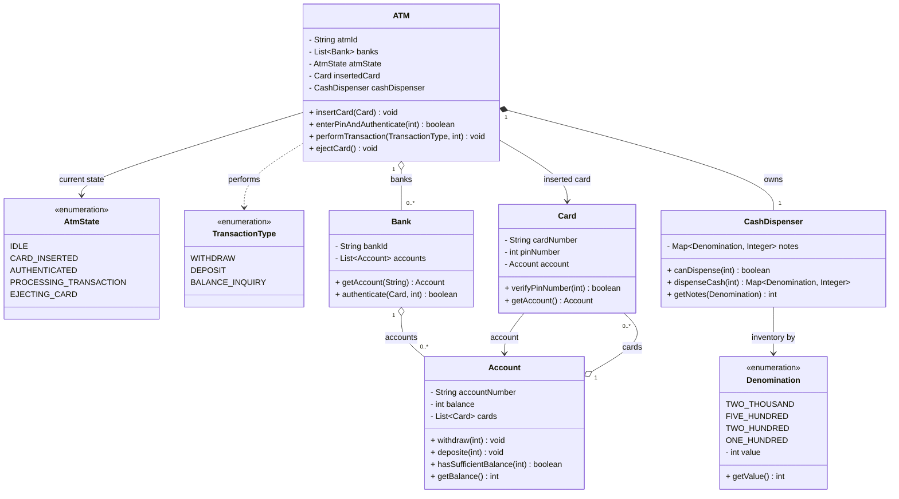

# ATM Machine

Models an ATM that authenticates a card via PIN, then runs withdraw / deposit /
balance-inquiry transactions against the card's account, dispensing real banknotes
by denomination.

## Design overview

- **`ATM`** — the orchestrator / state machine. Holds the inserted card, the available
  banks, a `CashDispenser`, and the current `AtmState`. Drives the flow:
  `insertCard → enterPinAndAuthenticate → performTransaction* → ejectCard`.
- **`AtmState`** — enum guarding the flow (`IDLE → CARD_INSERTED → AUTHENTICATED →
  PROCESSING_TRANSACTION → EJECTING_CARD`). Each `ATM` method asserts the expected state.
- **`Bank`** — owns `Account`s; can look one up by number and authenticate a card.
- **`Account`** — balance with `withdraw` / `deposite` / `hasSufficientBalance`.
- **`Card`** — card number + PIN, linked to one `Account`; `verifyPinNumber` checks the PIN.
- **`CashDispenser`** — inventory of notes keyed by `Denomination`. `canDispense` checks
  feasibility (greedy, largest-first); `dispenseCash` deducts and returns the note breakdown.
- **`Denomination`** — enum of note values (2000/500/200/100) carrying an `int value`.
- **`TransactionType`** — enum: `WITHDRAW`, `DEPOSIT`, `BALANCE_INQUIRY`.

## Flow

1. `insertCard(card)` — only from `IDLE`; moves to `CARD_INSERTED`.
2. `enterPinAndAuthenticate(pin)` — verifies the PIN; on success moves to `AUTHENTICATED`.
3. `performTransaction(type, amount)` — only from `AUTHENTICATED`; for `WITHDRAW` it checks
   both account balance **and** dispenser feasibility before deducting. Returns to
   `AUTHENTICATED` so multiple operations can run.
4. `ejectCard()` — clears the card and returns to `IDLE`.

## Class diagram

## Notes / trade-offs

- **State machine is hand-rolled** inside `ATM` via guard checks rather than a `State`
  pattern — simple and readable; a `State` interface would scale better for many states.
- **`CashDispenser` is greedy** (largest denomination first). It can fail to make exact
  change even when a different combination would succeed (classic coin-change limitation);
  `canDispense` honestly reports that case instead of dispensing wrong.
- **No `Transaction` class** — operations are handled inline in `performTransaction`. A
  `Transaction` abstraction (with `Withdraw`/`Deposit`/`BalanceInquiry` subtypes) would be
  the natural next tier if auditing/receipts were required.
- Money is modelled as `int` (whole units), sidestepping floating-point rounding.
