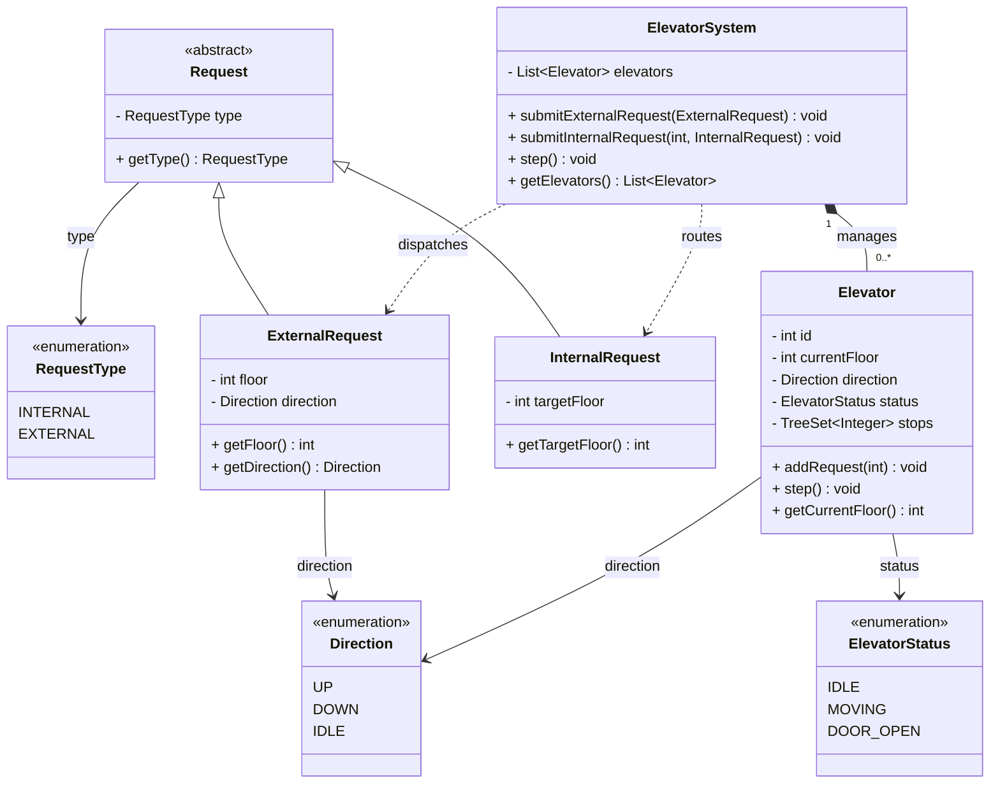

# Elevator System

Simulates a bank of elevators served by a central controller. Hall calls (outside) are
dispatched to the nearest car; car buttons (inside) are added directly to that car. Each car
advances one floor per `step()` tick using a simple SCAN-style scheduling rule.

## Design overview

- **`ElevatorSystem`** — the controller / dispatcher. Owns the cars, routes requests, and
  ticks every car forward.
  - `submitExternalRequest` — picks the **nearest** car (min `|currentFloor - requestFloor|`)
    and adds the floor as a stop.
  - `submitInternalRequest` — adds a target floor to a specific car.
  - `step()` — advances every car one tick.
- **`Elevator`** — a single car. Holds its floor, `Direction`, `ElevatorStatus`, and a
  `TreeSet<Integer>` of pending stops (a hall call and a car button are both just "stop here",
  so they share one sorted set). `step()` serves the current floor if requested, else moves
  one floor toward the next stop, keeping direction while there's work ahead and reversing
  when there isn't.
- **`Request`** — abstract base carrying a `RequestType`.
  - **`ExternalRequest`** — a hall call: `floor` + desired `Direction`.
  - **`InternalRequest`** — a car button: `targetFloor`.
- **`Direction`** — `UP` / `DOWN` / `IDLE`.
- **`ElevatorStatus`** — `IDLE` / `MOVING` / `DOOR_OPEN`.
- **`RequestType`** — `INTERNAL` / `EXTERNAL`.

## Scheduling (per car, in `step()`)

1. No stops → go `IDLE`.
2. Current floor is a stop → remove it, open doors (`DOOR_OPEN`).
3. Otherwise move one floor toward the next stop:
   - keep going **up** if already up and a stop is above; keep **down** if down and a stop below;
   - if nothing above → go down; nothing below → go up;
   - if stops exist both ways → head toward the **closer** one.

## Class diagram



## Usage

```java
ElevatorSystem system = new ElevatorSystem(2);

system.submitExternalRequest(new ExternalRequest(5, Direction.UP));
system.submitInternalRequest(0, new InternalRequest(8));
system.submitExternalRequest(new ExternalRequest(3, Direction.DOWN));

for (int tick = 1; tick <= 15; tick++) {
    system.step();   // every car advances one floor / serves a stop
}
```

## Notes / trade-offs

- **Dispatch is nearest-by-distance only** — it ignores travel direction and current load, so
  a car moving away can still be chosen. A real LOOK/SCAN dispatcher would also weigh whether
  the car is heading toward the call.
- **`ExternalRequest.direction` is captured but not used** in scheduling — stops are
  direction-agnostic (`TreeSet<Integer>`). Honoring it (separate up/down queues) is the next
  tier toward a true SCAN elevator.
- **`step()` is a discrete tick** (one floor per call) — simple and deterministic for testing;
  no real time, acceleration, or door timing modelled.
- **Single-threaded** — requests and ticks run on one thread; a real controller needs a
  concurrent queue feeding the cars.
