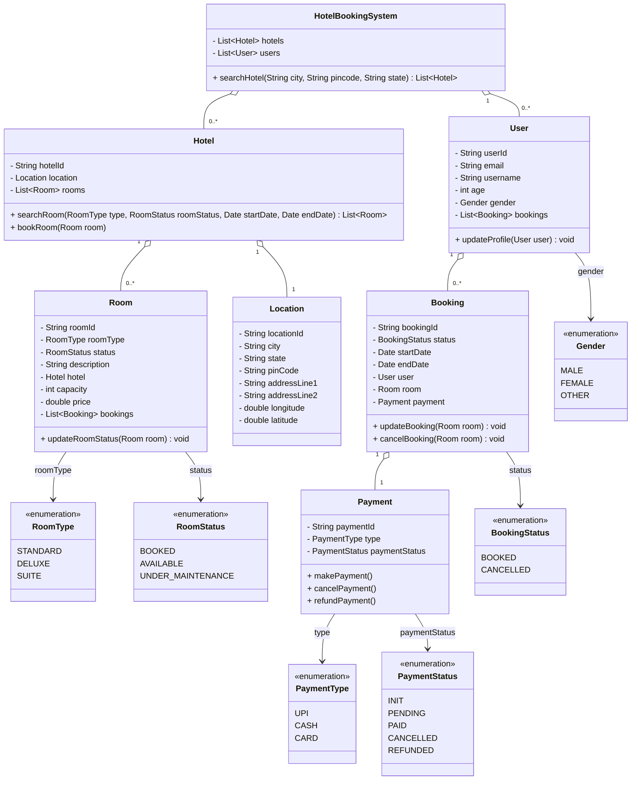

- A hotel system where user can search hotels based on city, area, country
- A user can see the available rooms of hotel
- A user can book the room with available date (standard or deluxe rooms)
- A user can do payment
- A user can receive notification on room availability