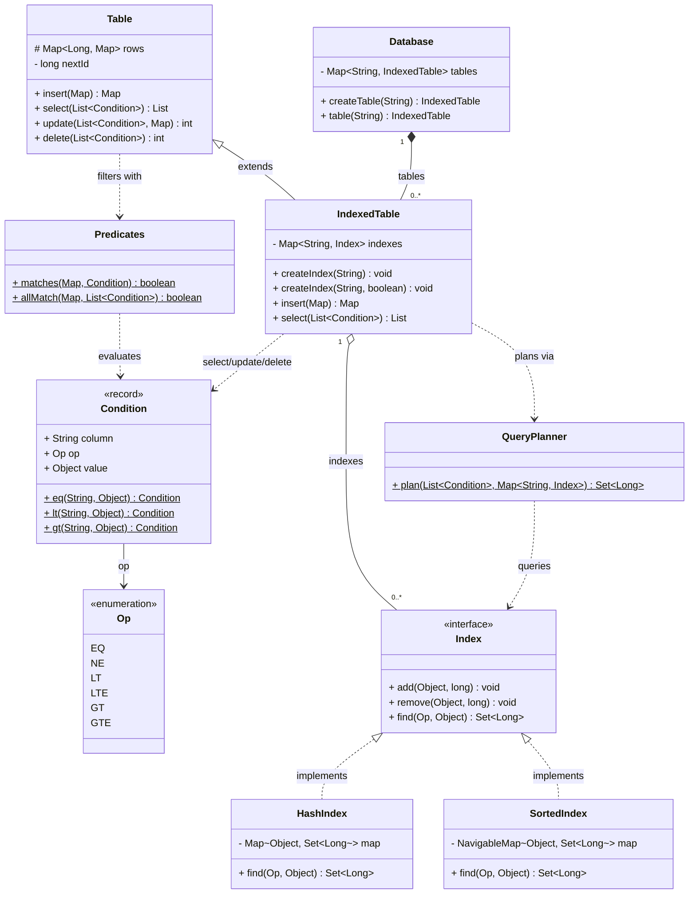

# In-Memory SQL

A tiny in-memory relational store supporting insert / select / update / delete with a WHERE
clause, optional secondary indexes (hash for equality, sorted for ranges), and a query planner
that picks an index when one can serve a condition. Built in tiers so each layer is readable
on its own.

## Tiers

- **Tier 1 — `Table`**: full-scan CRUD, no index. Rows are `rowId → (column → value)`,
  stored in a `LinkedHashMap` for deterministic, insertion-ordered scans.
- **Tier 2 — `IndexedTable` + `HashIndex`**: equality (`col = x`) in O(1) via an inverted
  index; writes keep every index in sync (with back-fill on `createIndex`).
- **Tier 3 — `SortedIndex` + `QueryPlanner`**: range queries (`<, <=, >, >=`) via a
  `TreeMap`, and a planner that chooses a usable index or falls back to a scan.

## Design overview

- **`Database`** — top-level container; `name → IndexedTable`.
- **`Table`** — base storage + full-scan CRUD. `select/update/delete` walk every row and test
  conditions via `Predicates`.
- **`IndexedTable`** (extends `Table`) — adds secondary indexes. Overrides every write to keep
  indexes consistent (insert adds; update removes-old-then-adds-new for changed indexed
  columns; delete removes before dropping the row). `select` asks the `QueryPlanner` for a
  candidate row set, then filters those (the planner narrows; predicates still verify).
- **`Index`** — strategy interface: `add`, `remove`, and `find(op, value)` returning candidate
  rowIds, or `null` meaning "I can't serve this op" → planner falls back to a scan.
  - **`HashIndex`** — `value → Set<rowId>`; serves only `EQ`.
  - **`SortedIndex`** — `TreeMap` of `value → Set<rowId>`; serves `EQ` and ranges via
    `subMap/headMap/tailMap`; returns `null` for `NE`.
- **`QueryPlanner`** — scans the conditions, returns the first index-servable candidate set,
  else `null` (full scan).
- **`Condition`** — a `record (column, op, value)` with SQL-like factories
  (`Condition.eq("age", 30)`). Conditions are ANDed.
- **`Predicates`** — evaluates a condition against a row (`Objects.equals` for EQ/NE,
  `Comparable` for ranges); `allMatch` short-circuits on first failure.
- **`Op`** — `EQ, NE, LT, LTE, GT, GTE`.

## Query flow (`IndexedTable.select`)

1. `QueryPlanner.plan(conditions, indexes)` → first index that can serve a condition returns a
   **candidate rowId set**; if none, returns `null`.
2. Candidates (or all rows on `null`) are fetched and re-checked against **all** conditions via
   `Predicates.allMatch` — so the index only narrows; correctness still comes from predicates.

## Class diagram



## Usage

```java
Database db = new Database();
IndexedTable users = db.createTable("users");

users.insert(Map.of("name", "Sam", "age", 30, "city", "NYC"));
users.insert(Map.of("name", "Lee", "age", 25, "city", "NYC"));

users.createIndex("age");            // hash index (back-fills existing rows)

// equality via hash index (O(1))
users.select(List.of(Condition.eq("age", 30)));

// AND of conditions: planner indexes one, predicates verify the rest
users.select(List.of(Condition.eq("age", 30), Condition.eq("city", "NYC")));

// range needs a sorted index
IndexedTable ranged = db.createTable("ranged");
ranged.createIndex("age", true);
ranged.select(List.of(Condition.gt("age", 25)));
```

## Notes / trade-offs

- **Indexes only narrow, predicates decide** — `select` re-filters candidates, so a partial
  or stale index can never return wrong rows, only a wider candidate set.
- **`null` = "can't serve"** is the key contract: `HashIndex` returns `null` for anything but
  `EQ`, `SortedIndex` for `NE`. The planner treats `null` uniformly as "scan".
- **Planner uses the first usable index**, not the most selective one. A real optimizer would
  estimate selectivity (and could intersect multiple index results) before choosing.
- **`IndexedTable extends Table`** is a teaching split to highlight what indexing adds; in
  practice you'd fold indexing into one class.
- **Write amplification**: every indexed column costs an index update on insert/update/delete —
  the standard read-speed-vs-write-cost trade.
- **Not thread-safe** and `id` is an auto-incremented surrogate added to every row.
