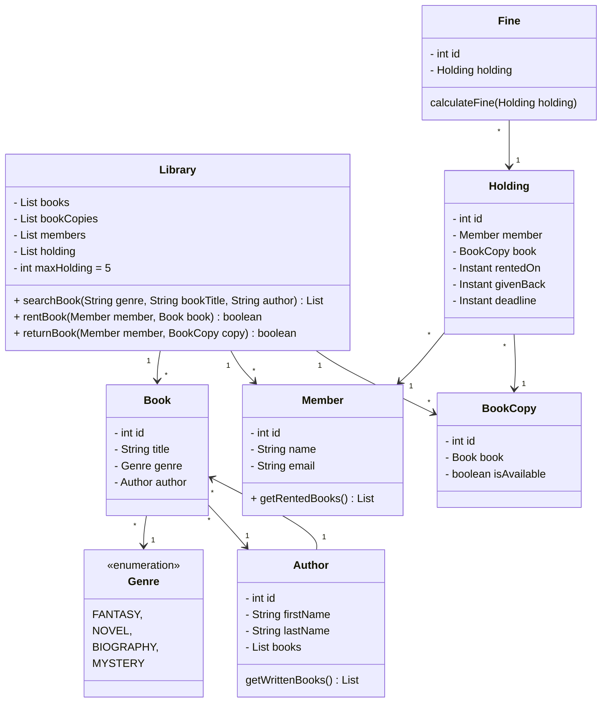

# Library Management System

Question #3 in the [question bank](../../README.md). Pure OOP-modeling problem — no hard algorithm; the grade rides on getting the entity split right and keeping `Library` from becoming a god class.

## The key modeling decision: Book vs BookCopy

The trap in this problem is conflating the *title* with the *physical item*. `Book` is the catalog entry (title, author, genre — one per ISBN); `BookCopy` is a physical unit on the shelf (many per book, each individually available or lent out). Availability lives on the copy, never the book. Similarly, `Holding` is the loan record — it ties a `Member` to a `BookCopy` with `rentedOn`/`deadline`/`givenBack` timestamps, so history is preserved after return and `Fine` can be computed from an overdue holding rather than stored as mutable state on the member.

## Class diagram

## Rent flow (implemented)

`rentBook(member, book)` — note it takes a `Book`, not a `BookCopy`: the member asks for a *title*, the library picks the copy.

1. Reject if the member is already at `MAX_HOLDING` (5) active loans.
2. Scan `bookCopies` for an available copy of that title; mark it unavailable.
3. Create a `Holding` with `rentedOn = now` and `deadline = now + 14 days`.

## Interview follow-ups to be ready for

- **Reservations/holds queue** — member waits for the next returned copy (a `Queue<Member>` per `Book`).
- **Fine calculation** — days overdue × rate, computed from the `Holding` on return, not accrued in the background.
- **Thread safety** — two members renting the last copy simultaneously; the check-and-rent in step 2 needs to be atomic (synchronize on the copy, or a `ConcurrentHashMap`-backed availability set).
- **Search** — linear scan is fine at this scale; mention indexing by title/author maps if pushed.

## TODO (unimplemented)

- `searchBook()` returns `null` — needs filter over `books` on the three optional criteria.
- `returnBook()` is a stub — should set `givenBack`, free the copy, and compute a `Fine` if past deadline.
- `Fine` exists but isn't wired into any flow.
