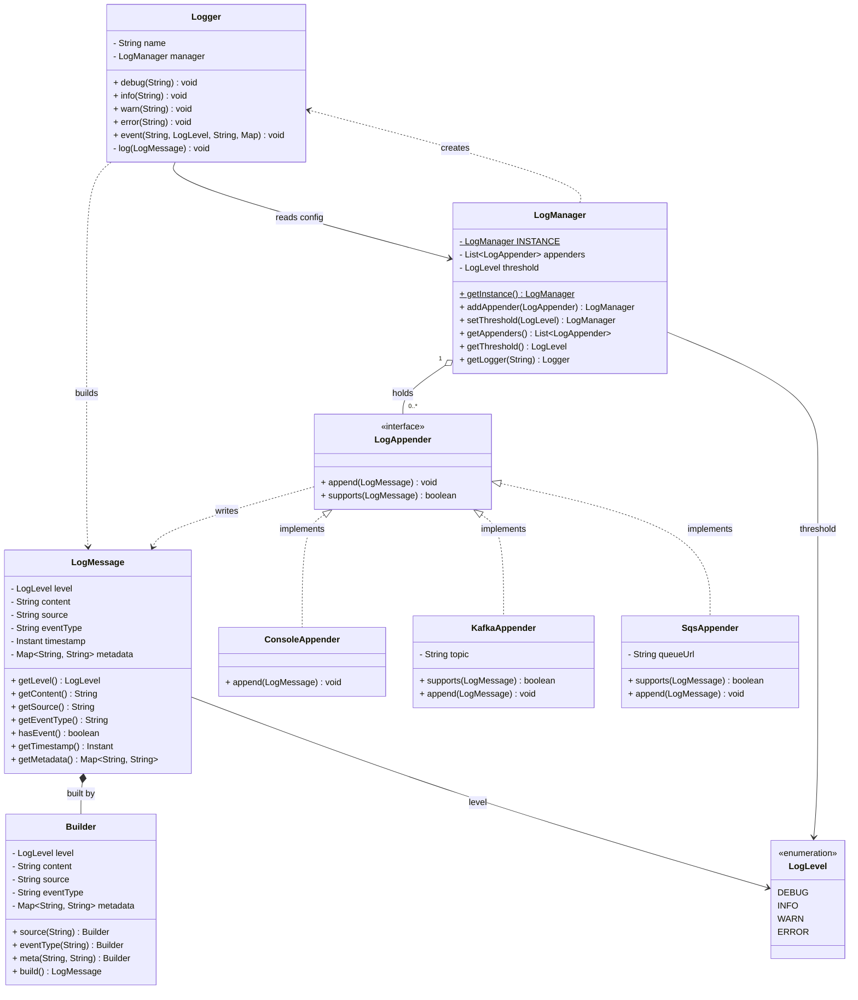

# Logging Framework

A small, extensible logging library: applications obtain a `Logger`, emit messages at a
level, and those messages fan out to one or more **appenders** (console, Kafka, SQS, …).
Configuration (appenders + level threshold) lives in a single `LogManager` singleton.

## Design overview

- **`LogManager`** — process-wide singleton holding the shared appender list and the level
  threshold. Hands out `Logger` instances via `getLogger(name)`.
- **`Logger`** — the facade the app talks to. Holds only its `name` and a reference back to
  the manager, so it reads config **live** on every call (changing the threshold or adding
  an appender after a logger is created still affects it).
- **`LogMessage`** — an immutable value object (built with a builder) carrying the level,
  content, source logger name, optional `eventType`, timestamp, and metadata.
- **`LogAppender`** — strategy interface for a destination. `supports(message)` lets an
  appender opt in/out per message; `append(message)` writes it.
  - `ConsoleAppender` — prints everything.
  - `KafkaAppender` / `SqsAppender` — only handle **event-tagged** messages
    (`message.hasEvent()`), i.e. those emitted via `Logger.event(...)`.

## Message flow

1. App calls `logger.info(...)` or `logger.event(...)`.
2. `Logger` builds a `LogMessage` (stamping its `name` as the source).
3. `Logger.log()` drops the message if its level is below the manager's threshold.
4. Surviving messages are offered to each appender; an appender writes it only if
   `supports(message)` is true.

This gives two orthogonal filters: a **global level threshold** and **per-appender routing**.

## Class diagram



## Usage

```java
LogManager.getInstance()
        .addAppender(new ConsoleAppender())
        .addAppender(new KafkaAppender("orders"))
        .addAppender(new SqsAppender("https://sqs/orders"))
        .setThreshold(LogLevel.DEBUG);

Logger log = LogManager.getInstance().getLogger("OrderService");

log.info("service started");
log.warn("cache miss for key session:abc");

Map<String, String> meta = new LinkedHashMap<>();
meta.put("orderId", "ord-9981");
log.event("ORDER_CREATED", LogLevel.INFO, "order created", meta);
```

Sample output:

```
2026-06-28T... [INFO] OrderService - service started
2026-06-28T... [WARN] OrderService - cache miss for key session:abc
2026-06-28T... [INFO] OrderService - order created {orderId=ord-9981}
  -> KAFKA publish topic=orders event=ORDER_CREATED payload=order created
  -> SQS send queue=https://sqs/orders event=ORDER_CREATED payload=order created
```

## Notes / trade-offs

- **Level filtering** uses `LogLevel.ordinal()`, so it relies on the enum being declared in
  ascending severity order (`DEBUG < INFO < WARN < ERROR`). Reordering the enum would break
  filtering — an explicit `int severity` field would remove that coupling.
- **Thread safety**: config (`appenders`, `threshold`) is mutated without synchronization.
  The intended usage is "configure once at startup, then read-only", which sidesteps it. For
  concurrent reconfiguration use a `CopyOnWriteArrayList` and a `volatile threshold`.
- **Routing** is intentionally implicit: an appender decides via `supports()`. Transport
  appenders (Kafka/SQS) only fire for messages created through `event(...)`.
