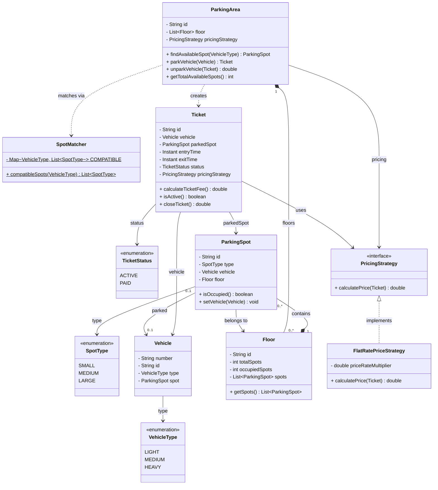

# Parking System

A multi-floor parking lot: a vehicle is matched to a compatible spot, parked, and issued a
ticket; on exit the ticket is closed and a fee is computed via a pluggable pricing strategy.

## Design overview

- **`ParkingArea`** — the facade. Owns the floors and a `PricingStrategy`. Finds an available
  compatible spot, parks the vehicle, and assembles the `Ticket` (it's the only place that
  knows vehicle + spot + strategy together).
- **`Floor`** — a list of `ParkingSpot`s.
- **`ParkingSpot`** — a single spot of a `SpotType`; occupancy is *derived* from whether a
  `Vehicle` is present (`isOccupied()` = `vehicle != null`).
- **`Vehicle`** — has a `VehicleType` used to decide which spots fit.
- **`SpotMatcher`** — static compatibility table mapping `VehicleType → [SpotType]`
  (LIGHT fits any; MEDIUM fits MEDIUM/LARGE; HEAVY needs LARGE). Tried in order, so a vehicle
  takes the smallest compatible spot first.
- **`Ticket`** — records vehicle, spot, entry/exit time, status, and the pricing strategy.
  `closeTicket()` stamps exit time, computes the fee, and flips status to `PAID`.
- **`PricingStrategy`** — strategy interface; `FlatRatePriceStrategy` charges a per-minute
  multiplier over the parked duration.
- **`SpotType` / `VehicleType` / `TicketStatus`** — enums.

## Flow

1. `parkVehicle(vehicle)` → `findAvailableSpot(type)` walks compatible spot types (via
   `SpotMatcher`) across floors, returns the first free match.
2. The spot records the vehicle (`setVehicle`); `ParkingArea` builds a `Ticket` (ACTIVE).
3. `unparkVehicle(ticket)` → `ticket.closeTicket()` computes the fee, then the spot is
   cleared (`setVehicle(null)`), freeing it.

## Class diagram

## Notes / trade-offs

- **Occupancy is derived, not stored** on the spot — `isOccupied()` reads `vehicle != null`,
  so there's a single source of truth and no flag to keep in sync. (`Floor.occupiedSpots`
  exists but is informational; the live count comes from scanning spots.)
- **Spot search is linear** over floors × spots. Fine for an interview; a real lot would
  index free spots per `SpotType` (e.g. a queue per type) for O(1) allocation.
- **Pricing is a strategy** so new schemes (tiered, daily cap, vehicle-type rates) plug in
  without touching `Ticket`/`ParkingArea`. Only `FlatRatePriceStrategy` ships today.
- **Concurrency** isn't handled: two threads could grab the same spot between find and set.
  A real system needs per-spot locking or an atomic claim.
