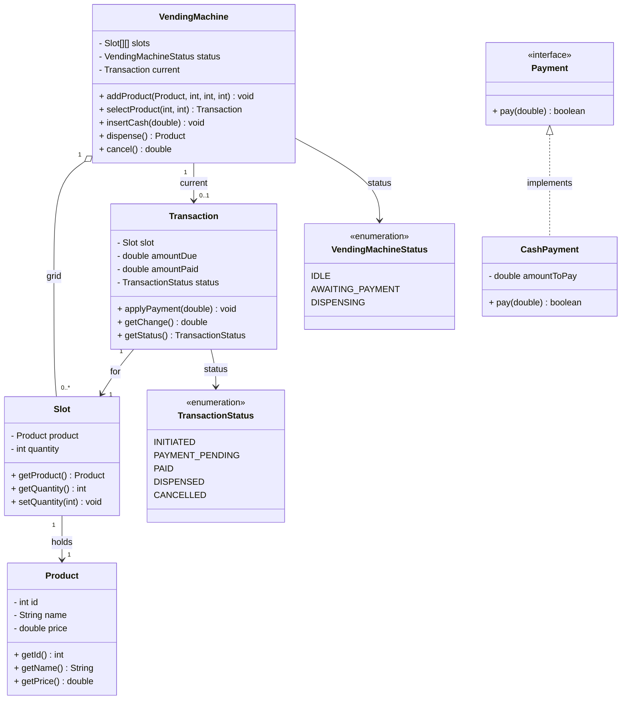

# Vending Machine

A grid-based vending machine: select a slot, feed cash until the price is covered, then
dispense the product and collect change. A single in-progress `Transaction` enforces that
one purchase happens at a time.

## Design overview

- **`VendingMachine`** — the controller. Holds the slot grid, a `VendingMachineStatus`, and
  the single `current` transaction (null when idle). Drives the flow and guards it by status.
- **`VendingMachineStatus`** — enum: `IDLE → AWAITING_PAYMENT → DISPENSING` (back to IDLE).
- **`Slot`** — one grid cell: a `Product` and its remaining `quantity`.
- **`Product`** — id, name, price.
- **`Transaction`** — the purchase in progress for one slot. Tracks `amountDue` /
  `amountPaid` and a `TransactionStatus`; `applyPayment` accumulates cash and flips itself to
  `PAID` once covered; `getChange()` returns the overpayment.
- **`TransactionStatus`** — enum: `INITIATED`, `PAYMENT_PENDING`, `PAID`, `DISPENSED`,
  `CANCELLED`.
- **`Payment` / `CashPayment`** — a strategy interface for *settling* a payment. Present as an
  extension point but **not currently wired into the purchase flow** (the machine drives
  `Transaction.applyPayment` directly).

## Flow

1. `selectProduct(row, col)` — only from `IDLE`; validates stock, opens a `Transaction` for
   the slot price, moves to `AWAITING_PAYMENT`.
2. `insertCash(amount)` — may be called repeatedly; each call accumulates into the
   transaction, which flips to `PAID` once `amountPaid >= amountDue`.
3. `dispense()` — requires `PAID`; decrements stock, returns the product, resets to `IDLE`.
   Change is reported separately via `Transaction.getChange()`.
4. `cancel()` — aborts and refunds whatever was inserted.

## Class diagram

## Notes / trade-offs

- **One purchase at a time** — `current` + status guards make the single-transaction
  invariant explicit; every entry point rejects calls made in the wrong state.
- **Change is reported, not dispensed** — `getChange()` returns the overpayment; modelling a
  coin hopper (like the ATM's `CashDispenser`) would be the next tier.
- **`Payment`/`CashPayment` is dead weight today** — it's a strategy seam for card/UPI/cash
  settlement but isn't called by the flow. Either wire `Transaction` to a `Payment`, or drop
  it until needed (it currently duplicates the `amountPaid >= amountDue` check).
- Money is `double`; fine for a demo, but real money should be integer minor units to avoid
  rounding.
